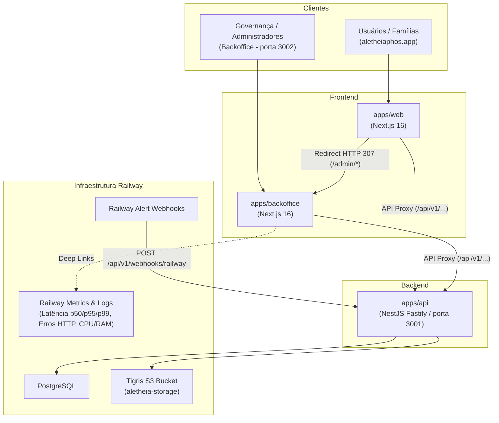

# Observabilidade e Cockpit Operacional

Este documento descreve a arquitetura de observabilidade, telemetria e o cockpit operacional do ecossistema Aletheia, implementados para a [Issue #254](https://github.com/Trinity-Grove/Aletheia/issues/254) (residual de governança da #30).

---

## 1. Visão Geral da Arquitetura

O sistema opera com uma **API central unificada** (`apps/api`), um **frontend de produto** focado 100% nas famílias e alunos (`apps/web`), e um **frontend de backoffice independente** (`apps/backoffice`) dedicado à governança, administração e monitoramento da infraestrutura.



---

## 2. Infraestrutura em Produção (Railway)

A produção está provisionada na plataforma **Railway**, que fornece nativamente observabilidade de tráfego, saturação e métricas de sistema sem a necessidade de agentes pesados ou daemons de terceiros no container da aplicação:

- **Projeto Railway**: `03668a5d-38e9-42c7-9fe2-c88d7a70b8cf` (`thriving-spontaneity`)
- **Ambiente**: `production` (`3fe527f6-394c-486c-bdb5-f734460dae55`)
- **Serviço Central da API**: `703b71b6-9614-402e-8148-782ab6b7a224` (`@aletheia/api` -> `https://api.aletheiaphos.app`)
- **Serviço Web**: `@aletheia/web` -> `https://aletheiaphos.app`
- **Banco de Dados**: PostgreSQL gerenciado (`postgres-production-4ad6.up.railway.app`)
- **Object Storage**: Bucket S3 nativo via Tigris (`https://t3.storageapi.dev`, bucket `aletheia-storage-or1hwvmo`). *Nota: MinIO é utilizado exclusivamente no ambiente local de desenvolvimento via `docker-compose.yml`.*

### Métricas Nativas Expostas pelo Railway
- **Latência de Requisições HTTP**: Percentis p50, p95 e p99 consolidados na borda.
- **Taxa de Erros HTTP**: Erros de aplicação (5xx) e requisições inválidas (4xx).
- **Uso de Recursos do Container**: CPU (vCPU), Memória RAM (MB/GB) e I/O de Disco.
- **Streaming de Logs**: Live log stream estruturado com nível de log configurado.

---

## 3. Cockpit Operacional no Backoffice (`apps/backoffice`)

O Backoffice (`/operations`) atua como cockpit central para visualização da integridade do ecossistema:

1. **Overall Health & Runtime Node.js**:
   - Status consolidado (`HEALTHY`, `DEGRADED`, `CRITICAL`).
   - Tempo de atividade do processo (`uptimeSeconds`).
   - Uso de memória heap (utilizada vs total) e memória RSS do container.
   - Versão do Node.js.
2. **Probes de Dependências**:
   - **PostgreSQL**: Estado (`UP` / `DOWN`), latência da probe em milissegundos e contagem de conexões ativas no pool quando disponível.
   - **Object Storage (Railway Bucket / Tigris)**: Estado (`UP` / `DOWN`) e latência da probe em milissegundos.
   - **Redis**: Estado (`UP`, `DOWN` ou `NOT_CONFIGURED`) e latência em milissegundos.
3. **Railway Cockpit & Deep Links**:
   - Atalhos diretos e contextualizados para a console do Railway (`metricsUrl`, `logsUrl`, `projectUrl`) com proteção `target="_blank"` e `rel="noopener noreferrer"`.
4. **Feed de Alertas e Incidentes**:
   - Lista cronológica dos eventos de alerta recebidos via webhook.
   - Badges semânticos de severidade (`CRITICAL`, `WARNING`, `INFO`).
   - Ação de reconhecimento operacional (**Acknowledge**) com registro do usuário e timestamp.

---

## 4. Webhook do Railway (`POST /api/v1/webhooks/railway`)

Para capturar alertas pré-configurados e notificações de ciclo de vida (falhas de deploy, crashes de container, alertas de limiar de recursos):

- **Rota**: `POST /api/v1/webhooks/railway`
- **Autenticação**: `RailwayWebhookGuard`
  - Requer a variável de ambiente `RAILWAY_WEBHOOK_SECRET`.
  - Suporta validação de header direto (`x-railway-secret` ou `x-railway-signature`) e assinatura criptográfica HMAC-SHA256 usando `crypto.timingSafeEqual` com mitigação a ataques de temporização.
- **Armazenamento**:
  - Salva em `operational_alert_events` com tipagem Zod e mapeamento automático de severidade (`CRITICAL` para crashes/erros, `INFO` para sucessos, `WARNING` por padrão).
- **Reconhecimento**:
  - `POST /api/v1/admin/operations/alerts/:id/acknowledge` protegido por `JwtAuthGuard` e `PlatformAdminGuard`.

---

## 5. Isolamento e Desacoplamento do `apps/web`

- O `apps/web` não contém nenhuma rota, componente ou teste administrativo.
- Requisições herdadas para `/admin/*` são interceptadas no `next.config.ts` do `apps/web` e redirecionadas via HTTP 307 para o `apps/backoffice`:
  ```typescript
  async redirects() {
    const backofficeUrl = (process.env.NEXT_PUBLIC_BACKOFFICE_URL || 'http://localhost:3002').replace(/\/+$/, '');
    return [
      {
        source: '/admin/:path*',
        destination: `${backofficeUrl}/:path*`,
        permanent: false,
      },
    ];
  }
  ```
- O controle de acesso ao Backoffice é garantido pelo `AdminAuthContext` e `AdminGuard`, que validam obrigatoriamente se `user.isPlatformAdmin === true`. Não-administradores recebem uma tela explícita de "Acesso Negado".
