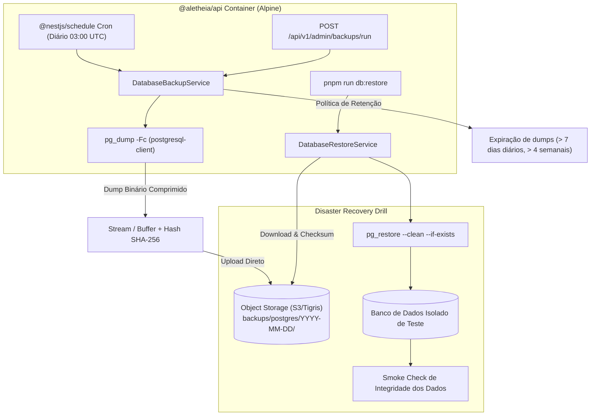

# Design Document: Backup Automatizado, Recuperação de Desastres e Observabilidade Operacional (Issue #30)

**Data:** 2026-09-19  
**Status:** Aprovado  
**Escopo:** `apps/api`, `@aletheia/contracts`, `infra`, `docs/runbooks`  
**Referência:** [Issue #30](https://github.com/Trinity-Grove/Aletheia/issues/30)

---

## 1. Contexto & Propósito

A aplicação Aletheia está em produção no Railway com banco de dados PostgreSQL e Object Storage compatível com S3 (Tigris). A [Issue #30](https://github.com/Trinity-Grove/Aletheia/issues/30) estabelece os requisitos de resiliência e continuidade operacional do MVP:
- Operar o MVP de forma previsível em homologação e produção.
- Backup automatizado do PostgreSQL para Object Storage.
- Procedimento e validação de restauração periódica comprovada em ambiente isolado (DR Drill).
- RPO e RTO definidos e testados.
- Runbooks operacionais de incidentes, migrações e rollback.

### Princípio Arquitetural: Portabilidade e Independência
A rotina de backup e restauração é **nativa da aplicação** (`@aletheia/api`), utilizando o `@nestjs/schedule` já presente no projeto e os binários oficiais `pg_dump`/`pg_restore` adicionados à imagem Alpine do container. Isso evita dependências de cron jobs externos (como GitHub Actions ou scripts de servidor) e permite migrar a plataforma para qualquer nuvem ou infraestrutura com portabilidade total.

---

## 2. Componentes e Fluxo de Arquitetura



---

## 3. Especificação Detalhada

### 3.1. Imagem Docker (`apps/api/Dockerfile`)
No estágio `runtime` do Dockerfile de produção, é adicionado o pacote `postgresql-client`:
```dockerfile
RUN apk add --no-cache postgresql-client
```
Isso disponibiliza `pg_dump` e `pg_restore` no PATH do container em produção e em containers locais baseados na imagem.

### 3.2. Contratos (`@aletheia/contracts`)
Novos schemas em `packages/contracts/src/backup.ts`:
- `backupMetadataSchema`:
  - `key`: string (caminho no S3)
  - `fileName`: string
  - `sizeBytes`: number
  - `sha256Checksum`: string
  - `createdAt`: ISO 8601 string
  - `database`: string
  - `durationMs`: number
- `backupListResponseSchema`: lista de `BackupMetadataDto`
- `backupRunResponseSchema`: resultado de execução sob demanda (`success`, `metadata`, `message`)

### 3.3. Serviço de Backup (`DatabaseBackupService`)
Localizado em `apps/api/src/modules/backup/database-backup.service.ts`:
1. **Extração de Conexão**: Faz parsing de `DATABASE_URL` para extrair host, porta, usuário, senha e nome do banco, configurando as variáveis de ambiente necessárias (`PGPASSWORD`, `PGHOST`, etc.) para o subprocesso do `pg_dump`.
2. **Execução de `pg_dump`**:
   - Argumentos: `-Fc` (formato custom compactado), `--no-owner`, `--no-privileges`.
   - Gera um arquivo temporário em disco ou stream seguro.
   - Calcula o hash SHA-256 do arquivo gerado.
3. **Upload para Object Storage**:
   - Grava o dump em `backups/postgres/YYYY-MM-DD/{timestamp}-{dbname}.dump`.
   - Grava metadados em `backups/postgres/YYYY-MM-DD/{timestamp}-{dbname}.meta.json`.
4. **Política de Retenção (Retention)**:
   - Lista os objetos sob o prefixo `backups/postgres/`.
   - Mantém os últimos 7 dias de backups diários.
   - Para backups com mais de 7 dias, retém o primeiro backup de cada semana (domingo) por até 4 semanas.
   - Deleta automaticamente backups que excedem a política de retenção.
5. **Agendamento Cron**:
   - `@Cron('0 3 * * *')` — Executa diariamente às 03:00 UTC (horário de menor tráfego).
   - Se `NODE_ENV === 'test'`, o agendamento pode ser desativado ou executado apenas sob demanda.

### 3.4. Controle Administrativo (`AdminBackupController`)
Rotas protegidas por `JwtAuthGuard` e `PlatformAdminGuard`:
- `GET /api/v1/admin/backups`: Lista todos os backups armazenados no S3 com data, tamanho, hash e status.
- `POST /api/v1/admin/backups/run`: Dispara manualmente um backup e retorna o relatório de execução.

### 3.5. Restauração e DR Drill (`DatabaseRestoreService` & CLI)
Localizado em `apps/api/src/modules/backup/database-restore.service.ts` e exposto via script `apps/api/src/scripts/restore-database.ts`:
1. Localiza o backup mais recente (ou chave especificada) no S3.
2. Faz download do `.dump` e do `.meta.json`.
3. Valida a integridade do arquivo comparando o SHA-256 calculado em tempo real com o SHA-256 do metadado.
4. Executa `pg_restore --clean --if-exists --no-owner --no-privileges` contra o banco alvo.
5. Realiza validação pós-restauração (contagem de usuários, famílias, etc.) para atestar a recuperação completa.

---

## 4. Métricas de Disponibilidade & Continuidade

### 4.1. RPO (Recovery Point Objective)
- **RPO Alvo:** 24 horas para backups automáticos diários de rotina.
- **RPO em Mudanças Críticas:** < 5 minutos — o operador executa `POST /api/v1/admin/backups/run` ou script pré-deploy antes de qualquer migration de banco.

### 4.2. RTO (Recovery Time Objective)
- **RTO Alvo:** < 15 minutos.
- O download do arquivo binário compactado via S3 e restauração via `pg_restore` em formato binário customizado (`-Fc`) leva menos de 2 minutos para bases de dados de até 10 GB.

---

## 5. Runbooks Operacionais (`docs/runbooks/`)

Dois runbooks essenciais documentados no repositório:
1. `docs/runbooks/disaster-recovery.md`: Procedimento passo a passo para restaurar o banco de dados em um novo servidor ou instância limpa em caso de corrupção ou indisponibilidade total do provedor.
2. `docs/runbooks/database-migration-rollback.md`: Procedimento de segurança para aplicação de migrações do Prisma com snapshot prévio e plano de contingência caso uma migration falhe.

---

## 6. Estratégia de Testes

1. **Testes Unitários (`database-backup.service.spec.ts`)**:
   - Validação da extração de parâmetros de conexão de `DATABASE_URL`.
   - Cálculo e validação do hash SHA-256.
   - Lógica da política de retenção (7 dias diários / 4 semanas).
2. **Teste de Integração / DR Drill (`test/disaster-recovery.integration-spec.ts`)**:
   - Cria dados em um banco de teste.
   - Dispara o backup para o storage de teste.
   - Restaura o dump em uma base de dados isolada.
   - Assert: todos os registros inseridos antes do backup existem e coincidem 100% no banco restaurado.
