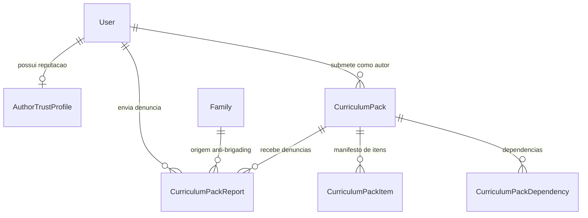
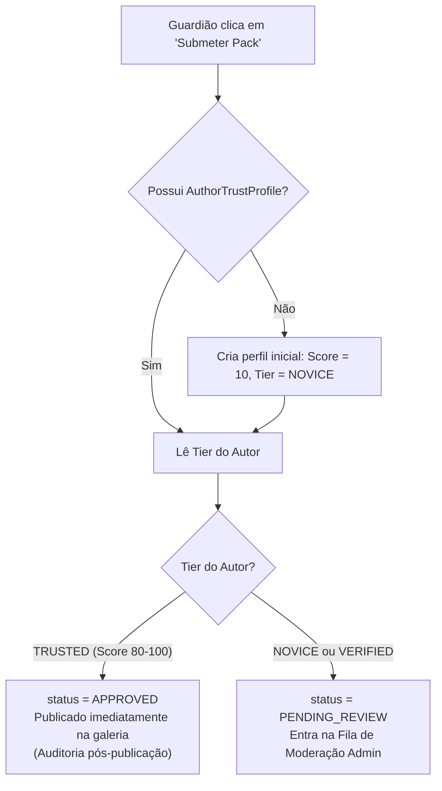

# Design: Moderação Comunitária de Curriculum Packs via Fator de Confiabilidade e Volume de Denúncias

**Data:** 2026-09-23  
**Status:** Approved  
**Issue Relacionada:** #102 (Moderação comunitária de Curriculum Packs via fator de confiabilidade + volume de denúncias)  
**Dependências / Contexto:** #96 (Curriculum Packs e Portabilidade), #101 (Platform Admin do Catálogo Central)

---

## 1. Visão Geral e Motivação

### 1.1. Contexto e Problema
Aletheia permite que currículos e taxonomias pedagógicas sejam empacotados em artefatos portáveis denominados **Curriculum Packs** (Issue #96). Até o momento, a criação e publicação de Curriculum Packs esteve restrita a administradores da plataforma (`isPlatformAdmin`).

Com a abertura do ecossistema para contribuições da comunidade de educadores e famílias (UGC - *User-Generated Content*), surge a necessidade de um sistema de moderação distribuído que equilibre:
1. **Agilidade para autores confiáveis:** Autores com histórico comprovado não devem ficar travados em filas burocráticas lentas.
2. **Proteção preventiva para famílias e educandos:** Novos autores ou conteúdos suspeitos não podem ser imediatamente expostos à comunidade sem verificação.
3. **Resiliência contra ataques de denúncias em massa (*brigading*):** Denúncias repetidas pela mesma família ou grupos coordenados não podem derrubar packs arbitrariamente.
4. **Neutralidade Teológica e Doutrinária:** Conforme estabelecido na discussão da Issue #102 e na taxonomia teológica da Issue #96, denúncias **nunca** serão utilizadas como tribunal para definir qual interpretação teológica é válida. O foco da moderação é estritamente segurança da criança, spam, violação de direitos autorais e qualidade técnica do pacote.

---

## 2. Arquitetura e Modelagem de Dados

### 2.1. Diagrama de Relacionamentos (ERD)



### 2.2. Modificações no Schema Prisma (`apps/api/prisma/schema.prisma`)

#### A. Atualização em `CurriculumPack`
Adição de campos para distinguir packs oficiais do sistema de packs da comunidade, além de rastrear o estado de moderação:

```prisma
enum CurriculumPackModerationStatus {
  DRAFT
  PENDING_REVIEW
  APPROVED
  SUSPENDED
  REJECTED
}

model CurriculumPack {
  // Campos existentes...
  id            String           @id @default(uuid()) @db.Uuid
  code          String
  version       Int              @default(1)
  status        DefinitionStatus @default(DRAFT)
  schemaVersion String           @default("1.0.0") @map("schema_version")
  name          String
  description   String?
  metadata      Json             @default("{}")
  createdAt     DateTime         @default(now()) @map("created_at") @db.Timestamptz
  publishedAt   DateTime?        @map("published_at") @db.Timestamptz
  deprecatedAt  DateTime?        @map("deprecated_at") @db.Timestamptz

  // Novos campos de autoria comunitária e moderação (Issue #102)
  authorUserId       String?                        @map("author_user_id") @db.Uuid
  moderationStatus   CurriculumPackModerationStatus @default(DRAFT) @map("moderation_status")
  moderationNotes    String?                        @map("moderation_notes")
  moderatedAt        DateTime?                      @map("moderated_at") @db.Timestamptz
  moderatedByUserId  String?                        @map("moderated_by_user_id") @db.Uuid

  author             User?                          @relation("UserAuthoredPacks", fields: [authorUserId], references: [id], onDelete: SetNull)
  moderatedBy        User?                          @relation("UserModeratedPacks", fields: [moderatedByUserId], references: [id], onDelete: SetNull)
  reports            CurriculumPackReport[]

  items              CurriculumPackItem[]
  dependencies       CurriculumPackDependency[]
  familyInstances    FamilyCurriculumPack[]

  @@unique([code, version])
  @@index([code])
  @@index([status])
  @@index([moderationStatus])
  @@index([authorUserId])
  @@map("curriculum_packs")
}
```

#### B. Nova Tabela: `AuthorTrustProfile`
Armazena a reputação contínua de guardiões que publicam packs na plataforma:

```prisma
enum AuthorTrustTier {
  NOVICE     // 0 - 39: Pré-moderação obrigatória
  VERIFIED   // 40 - 79: Pré-moderação prioritária
  TRUSTED    // 80 - 100: Publicação direta com auditoria pós-publicação
}

model AuthorTrustProfile {
  userId             String          @id @map("user_id") @db.Uuid
  trustScore         Int             @default(10) @map("trust_score")
  tier               AuthorTrustTier @default(NOVICE)
  approvedPacksCount Int             @default(0) @map("approved_packs_count")
  rejectedPacksCount Int             @default(0) @map("rejected_packs_count")
  upheldReportsCount Int             @default(0) @map("upheld_reports_count")
  lastEvaluatedAt    DateTime        @default(now()) @map("last_evaluated_at") @db.Timestamptz
  createdAt          DateTime        @default(now()) @map("created_at") @db.Timestamptz
  updatedAt          DateTime        @updatedAt @map("updated_at") @db.Timestamptz

  user               User            @relation(fields: [userId], references: [id], onDelete: Cascade)

  @@index([tier])
  @@map("author_trust_profiles")
}
```

#### C. Nova Tabela: `CurriculumPackReport`
Registra e audita denúncias submetidas por famílias:

```prisma
enum PackReportReason {
  SPAM_COMMERCIAL         // Propaganda, venda indevida ou links fraudulentos
  HARMFUL_INAPPROPRIATE   // Conteúdo inseguro, ofensivo ou inadequado para menores
  COPYRIGHT_PLAGIARISM    // Violação de direitos autorais ou plágio evidente
  MALFORMED_QUALITY       // Pacote inutilizável, links corrompidos ou erros técnicos graves
  OTHER                   // Outro motivo com justificativa em texto
}

enum PackReportStatus {
  OPEN                    // Pendente de avaliação pelo moderador
  UPHELD                  // Denúncia julgada procedente (ação punitiva / suspensão confirmada)
  DISMISSED               // Denúncia julgada improcedente ou má-fé
}

model CurriculumPackReport {
  id               String           @id @default(uuid()) @db.Uuid
  packId           String           @map("pack_id") @db.Uuid
  reporterUserId   String           @map("reporter_user_id") @db.Uuid
  reporterFamilyId String           @map("reporter_family_id") @db.Uuid
  reason           PackReportReason
  details          String?
  status           PackReportStatus @default(OPEN)
  createdAt        DateTime         @default(now()) @map("created_at") @db.Timestamptz
  resolvedAt       DateTime?        @map("resolved_at") @db.Timestamptz
  resolvedByUserId String?          @map("resolved_by_user_id") @db.Uuid

  pack             CurriculumPack   @relation(fields: [packId], references: [id], onDelete: Cascade)
  reporterUser     User             @relation("UserSubmittedReports", fields: [reporterUserId], references: [id], onDelete: Cascade)
  reporterFamily   Family           @relation(fields: [reporterFamilyId], references: [id], onDelete: Cascade)
  resolvedBy       User?            @relation("UserResolvedReports", fields: [resolvedByUserId], references: [id], onDelete: SetNull)

  @@unique([packId, reporterFamilyId], name: "curriculum_pack_reports_pack_family_unique")
  @@index([packId, status])
  @@index([reporterFamilyId])
  @@map("curriculum_pack_reports")
}
```

---

## 3. Regras de Negócio e Algoritmo de Reputação

### 3.1. Ciclo de Submissão de Packs



### 3.2. Gatilho de Quarentena / Suspensão Automática
1. Quando uma família denuncia um pack ativo (`APPROVED`), o sistema persiste o `CurriculumPackReport`.
2. O sistema executa:
   ```ts
   const openDistinctReports = await prisma.curriculumPackReport.count({
     where: { packId, status: 'OPEN' },
   });
   ```
3. **Limiar:** Se `openDistinctReports >= 3`:
   - O `moderationStatus` do pack é automaticamente alterado para `SUSPENDED`.
   - O pack é instantaneamente ocultado da vitrine pública de novas instalações.
   - Um evento de prioridade alta é sinalizado na fila do `/admin/moderation`.
   - **Garantia de Não-Interrupção das Famílias:** Qualquer família que já tenha instalado o pack em seu plano ativo ([`FamilyCurriculumPack`](file:///C:/Users/wende/Projects/Covenant-Grove/Aletheia/apps/api/prisma/schema.prisma)) continuará com seu currículo operacional. A suspensão afeta apenas a vitrine pública de novas adesões.

### 3.3. Algoritmo Determinístico de Cálculo do Trust Score
O Trust Score varia de `0` a `100` e é recalculado de forma pura e idempotente:

$$\text{Score} = 10 + (\text{approved} \times 15) + (\text{accountBonus}) - (\text{upheldReports} \times 20) - (\text{rejectedPacks} \times 30)$$

- **Score Inicial Base:** `10 pontos`.
- **Bônus de Conta:** $+5$ pontos por cada 30 dias de conta ativa sem infrações (máximo de $+20$).
- **Aprovação de Pack:** $+15$ pontos por pacote aprovado por moderador.
- **Denúncia Procedente (`UPHELD`):** $-20$ pontos por cada denúncia procedente contra conteúdo do autor.
- **Rejeição por Violação de Diretrizes:** $-30$ pontos por pacote rejeitado pela moderação.
- **Limites:** $\min = 0$, $\max = 100$.

#### Mapeamento de Tiers:
- **`NOVICE`**: $0 \le \text{Score} \le 39$ $\rightarrow$ Pré-moderação obrigatória em todos os envios.
- **`VERIFIED`**: $40 \le \text{Score} \le 79$ $\rightarrow$ Pré-moderação com prioridade na fila de revisão.
- **`TRUSTED`**: $80 \le \text{Score} \le 100$ $\rightarrow$ Publicação imediata com auditoria a posteriori.

---

## 4. Especificação de Contratos e DTOs (`@aletheia/contracts`)

No arquivo `packages/contracts/src/curriculum-pack-moderation.ts` (ou integrado em `curriculum-pack.ts`):

```ts
export const curriculumPackModerationStatusSchema = z.enum([
  'DRAFT',
  'PENDING_REVIEW',
  'APPROVED',
  'SUSPENDED',
  'REJECTED',
]);

export const authorTrustTierSchema = z.enum(['NOVICE', 'VERIFIED', 'TRUSTED']);

export const packReportReasonSchema = z.enum([
  'SPAM_COMMERCIAL',
  'HARMFUL_INAPPROPRIATE',
  'COPYRIGHT_PLAGIARISM',
  'MALFORMED_QUALITY',
  'OTHER',
]);

export const packReportStatusSchema = z.enum(['OPEN', 'UPHELD', 'DISMISSED']);

export const createPackReportSchema = z.object({
  reason: packReportReasonSchema,
  details: z.string().max(2000).nullish(),
});

export const adminModeratePackSchema = z.object({
  action: z.enum(['APPROVE', 'REJECT', 'SUSPEND', 'RESTORE']),
  notes: z.string().max(2000).nullish(),
});

export const adminResolveReportSchema = z.object({
  status: z.enum(['UPHELD', 'DISMISSED']),
  notes: z.string().max(2000).nullish(),
});
```

---

## 5. Endpoints da API (`apps/api`)

### 5.1. Endpoints do Guardião / Família
- `POST /api/v1/curriculum-packs`
  - Cria um pack comunitário com `authorUserId = req.user.id`.
- `POST /api/v1/curriculum-packs/:id/submit`
  - Submete o pack. Avalia o `AuthorTrustProfile` do usuário: se `TRUSTED`, aprova automaticamente; se `NOVICE/VERIFIED`, move para `PENDING_REVIEW`.
- `POST /api/v1/curriculum-packs/:id/reports`
  - Protegido por `JwtAuthGuard` e `FamilyTenantGuard`. Registra a denúncia com a família ativa. Verifica gatilho de auto-suspensão se contagem $\ge 3$.
- `GET /api/v1/curriculum-packs/author-profile`
  - Retorna o `AuthorTrustProfile` do usuário logado (score, tier e métricas).
- `GET /api/v1/curriculum-packs/my-packs`
  - Lista os packs criados pelo guardião atual com seus respectivos status de moderação.

### 5.2. Endpoint da Galeria Pública
- `GET /api/v1/curriculum-packs`
  - Altera a consulta existente para filtrar apenas:
    ```ts
    where: {
      status: 'PUBLISHED',
      moderationStatus: 'APPROVED',
    }
    ```

### 5.3. Endpoints de Administração (`PlatformAdminGuard`)
- `GET /api/v1/admin/moderation/queue`
  - Lista itens na fila (`PENDING_REVIEW` e `SUSPENDED`) com informações do autor e contagem de denúncias.
- `POST /api/v1/admin/moderation/packs/:id/moderate`
  - Executa ação de moderação (`APPROVE`, `REJECT`, `SUSPEND`, `RESTORE`), atualiza o pack e recalcula o trust score do autor.
- `GET /api/v1/admin/moderation/reports`
  - Lista todas as denúncias com filtros por status (`OPEN`, `UPHELD`, `DISMISSED`) e por pack.
- `POST /api/v1/admin/moderation/reports/:id/resolve`
  - Resolve uma denúncia (`UPHELD` ou `DISMISSED`) e ajusta pontuação do autor infrator se procedente.

---

## 6. Interface Web (`apps/web`)

1. **Modal de Denúncia (`PackReportModal`):**
   - Disponível no card e na visualização detalhada do pack na galeria.
   - Seleção do motivo em rádio/select, campo de justificativa e confirmação.
2. **Dashboard de Moderação Administrativa (`/admin/moderation`):**
   - Rota protegida para administradores da plataforma.
   - Tabs: "Fila de Revisão de Packs" e "Denúncias da Comunidade".
   - Ações com modal de confirmação para aprovar, suspender, rejeitar ou restaurar packs.
3. **Indicador de Confiabilidade do Autor:**
   - Exibição de badge do autor (`NOVICE`, `VERIFIED`, `TRUSTED`) com tooltip explicativo.
4. **Suporte a Internacionalização (i18n):**
   - Todas as strings em `pt-BR`, `en-US` e `es-ES` dentro do domínio `curriculum`.

---

## 7. Estratégia de Testes

1. **Contratos (`packages/contracts`):**
   - Validação dos schemas Zod, rejeição de payloads inválidos e integridade de tipos.
2. **Serviços Backend (`apps/api`):**
   - Teste unitário do motor de cálculo de score (verificação de limites 0-100, bônus de conta e penalidades).
   - Teste do fluxo de submissão para autor `TRUSTED` (auto-aprovação) vs `NOVICE` (fila de revisão).
   - Teste do gatilho de auto-suspensão ao atingir 3 denúncias de famílias distintas.
   - Teste da unicidade anti-brigading (rejeição de denúncia duplicada pela mesma família).
3. **Controladores e Integração RBAC:**
   - Bloqueio de acesso a `/admin/moderation/*` para usuários que não sejam `PlatformAdmin`.
   - Isolamento multi-tenant garantido pelo `FamilyTenantGuard` nas denúncias.
4. **Frontend (`apps/web`):**
   - Teste de renderização do `PackReportModal` e submissão de denúncia.
   - Teste de exibição da fila de moderação em `/admin/moderation`.
