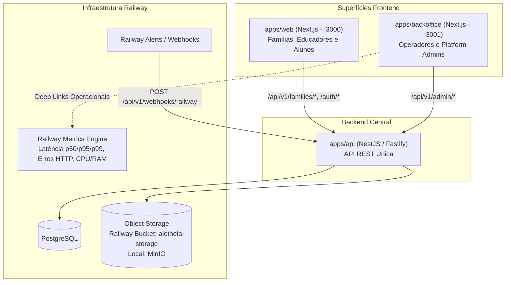

# Design: Frontend de Backoffice Separado e Dashboard Operacional de Observabilidade com Webhooks do Railway

**Data:** 2026-09-25  
**Status:** In Review  
**Issues Relacionadas:**  
- #254 ([P1] Dashboard operacional de erros, latência e saturação — remanescente da #30)  
- #30 ([P1] Preparar deploy, observabilidade, backups e recuperação)  
- #101 / #102 (Platform Admin do Catálogo Central e Moderação Comunitária)  

---

## 1. Visão Geral e Motivação

### 1.1. Contexto e Problema
Atualmente, o Aletheia opera com uma aplicação web única (`apps/web`) que atende tanto as famílias/educandos quanto as telas administrativas da plataforma (`/admin/catalog` e `/admin/moderation`), controladas apenas por verificações de role (`isPlatformAdmin`).

Essa mistura traz desvantagens arquiteturais:
1. **Acoplamento de Domínios:** O código de produto do usuário final (diário de bordo, rotinas, trilhas de aprendizagem) convive no mesmo bundle e na mesma árvore de rotas de governança de catálogo e moderação.
2. **Segurança e Superfície de Ataque:** Ferramentas de backoffice e operações não devem estar expostas na mesma interface voltada a crianças e famílias.
3. **Lacuna da Issue #254 (Observabilidade Operacional):** Conforme auditado na Issue #254, o critério de aceitação de acompanhamento de erros, latência e saturação da infraestrutura (#30) permaneceu pendente.
4. **Alinhamento com a Infraestrutura Real (Railway):** A produção do Aletheia roda no Railway, que já coleta e exibe nativamente taxas de erro HTTP, latência (p50/p95/p99) e uso de CPU/memória/disco por serviço (API, Web, Postgres, Bucket) sem exigir a instalação de pilhas pesadas locais (Grafana/Prometheus).

### 1.2. Objetivos
- **Isolamento de Backoffice:** Criar um frontend autônomo (`apps/backoffice`) no monorepo, dedicado à gestão da plataforma, operando em porta e subdomínio próprios, com acesso restrito a administradores (`isPlatformAdmin === true`).
- **Desacoplamento do Produto (`apps/web`):** Remover todas as páginas e itens de menu de administração de `apps/web`, redirecionando qualquer requisição legada para o Backoffice.
- **Backend Unificado (`apps/api`):** Manter rigorosamente uma única API central, estendendo o namespace `/api/v1/admin/operations` para métricas e status de saturação.
- **Dashboard Operacional (#254):** Entregar a interface operacional no Backoffice com dados de saúde da aplicação e saturação em tempo real (Postgres pool, MinIO, processo Node.js), links profundos contextuais para os gráficos de latência/erros no Railway, e um feed de alertas em tempo real.
- **Recepção de Webhooks do Railway:** Implementar um endpoint seguro na API para capturar e persistir alertas de infraestrutura disparados pelo Railway (queda de containers, saturação, falha de deploy/health check).

---

## 2. Arquitetura e Modelagem de Dados

### 2.1. Topologia de Aplicações do Monorepo



---

### 2.2. Modelagem Prisma (`apps/api/prisma/schema.prisma`)

Para persistir os alertas operacionais recebidos via webhook do Railway de forma auditável e resiliente a reinicializações:

```prisma
enum AlertSeverity {
  INFO
  WARNING
  CRITICAL
}

model OperationalAlertEvent {
  id              String        @id @default(uuid()) @db.Uuid
  source          String        @default("RAILWAY") // "RAILWAY", "SYSTEM", "HEALTH_PROBE"
  eventType       String        @map("event_type")  // "DEPLOY_FAILED", "CRASH", "HEALTHCHECK_FAIL", "RESOURCE_ALERT"
  severity        AlertSeverity @default(WARNING)
  serviceName     String?       @map("service_name") // "api", "web", "postgres", "storage"
  message         String
  payload         Json          @default("{}")
  receivedAt      DateTime      @default(now()) @map("received_at") @db.Timestamptz
  acknowledgedAt  DateTime?     @map("acknowledged_at") @db.Timestamptz
  acknowledgedBy  String?       @map("acknowledged_by") @db.Uuid

  @@index([receivedAt(sort: Desc)])
  @@index([severity])
  @@index([eventType])
  @@map("operational_alert_events")
}
```

---

## 3. Contratos e DTOs (`@aletheia/contracts`)

Novos schemas e tipos Zod no pacote `@aletheia/contracts` exportados para consumo compartilhado entre `apps/api` e `apps/backoffice`:

### 3.1. DTO de Status Operacional e Saturação
```typescript
export const DependencyProbeStatusSchema = z.object({
  status: z.enum(['UP', 'DOWN', 'DEGRADED', 'NOT_CONFIGURED']),
  responseTimeMs: z.number().nonnegative(),
  details: z.record(z.unknown()).optional(),
});

export const OperationalStatusResponseSchema = z.object({
  service: z.literal('aletheia-api'),
  version: z.string(),
  uptimeSeconds: z.number().nonnegative(),
  timestamp: z.string().datetime(),
  overallHealth: z.enum(['HEALTHY', 'DEGRADED', 'CRITICAL']),
  dependencies: z.object({
    postgres: DependencyProbeStatusSchema.extend({
      activeConnections: z.number().int().nonnegative().optional(),
    }),
    objectStorage: DependencyProbeStatusSchema,
    redis: DependencyProbeStatusSchema,
  }),
  resources: z.object({
    memoryHeapUsedMb: z.number().nonnegative(),
    memoryHeapTotalMb: z.number().nonnegative(),
    memoryRssMb: z.number().nonnegative(),
    nodeVersion: z.string(),
  }),
  railwayDashboardLinks: z.object({
    projectUrl: z.string().url().optional(),
    metricsUrl: z.string().url().optional(),
    logsUrl: z.string().url().optional(),
  }),
});

export type OperationalStatusResponseDto = z.infer<typeof OperationalStatusResponseSchema>;
```

### 3.2. DTOs de Alertas Operacionais
```typescript
export const OperationalAlertEventSchema = z.object({
  id: z.string().uuid(),
  source: z.string(),
  eventType: z.string(),
  severity: z.enum(['INFO', 'WARNING', 'CRITICAL']),
  serviceName: z.string().nullable(),
  message: z.string(),
  payload: z.record(z.unknown()),
  receivedAt: z.string().datetime(),
  acknowledgedAt: z.string().datetime().nullable(),
  acknowledgedBy: z.string().uuid().nullable(),
});

export type OperationalAlertEventDto = z.infer<typeof OperationalAlertEventSchema>;

export const AcknowledgeAlertSchema = z.object({
  notes: z.string().optional(),
});
export type AcknowledgeAlertDto = z.infer<typeof AcknowledgeAlertSchema>;
```

### 3.3. DTO do Webhook do Railway
```typescript
export const RailwayWebhookPayloadSchema = z.object({
  type: z.string(), // ex: "DEPLOY", "CRASH", "ALERT"
  environment: z.string().optional(),
  project: z.object({
    id: z.string().optional(),
    name: z.string().optional(),
  }).optional(),
  service: z.object({
    id: z.string().optional(),
    name: z.string().optional(),
  }).optional(),
  deployment: z.object({
    id: z.string().optional(),
    status: z.string().optional(),
  }).optional(),
  message: z.string().optional(),
  text: z.string().optional(),
  severity: z.enum(['INFO', 'WARNING', 'CRITICAL']).optional(),
}).passthrough();

export type RailwayWebhookPayloadDto = z.infer<typeof RailwayWebhookPayloadSchema>;
```

---

## 4. Backend (`apps/api`)

### 4.1. Módulo `OperationsModule`
Localizado em `apps/api/src/modules/operations/`:
- **`OperationsService`:**
  - Consulta o estado das dependências (reutilizando os probes de PostgreSQL, MinIO e Redis já existentes em `apps/api/src/health/`).
  - Mede tempo de resposta de cada probe em milissegundos.
  - Extrai métricas do processo Node.js (`process.memoryUsage()`, `process.uptime()`).
  - Monta os links profundos para os dashboards do Railway a partir de variáveis de ambiente (`RAILWAY_PROJECT_URL`, `RAILWAY_METRICS_URL`, `RAILWAY_LOGS_URL`).
  - Realiza queries na tabela `operational_alert_events` para listar e marcar alertas como reconhecidos.
- **`OperationsController` (`/api/v1/admin/operations`):**
  - `@UseGuards(JwtAuthGuard, PlatformAdminGuard)` em todos os endpoints:
    - `GET /status`: Retorna o payload consolidado `OperationalStatusResponseDto`.
    - `GET /alerts`: Retorna lista ordenada de alertas com suporte a filtro `acknowledged=true|false`.
    - `POST /alerts/:id/acknowledge`: Registra `acknowledgedAt: now()` e `acknowledgedBy: user.id`.

### 4.2. Receptor de Webhooks do Railway (`/api/v1/webhooks/railway`)
- Endpoint público com guard de assinatura: `RailwayWebhookGuard`.
  - Verifica o header `x-railway-signature` ou query/header `x-railway-secret` contra `process.env.RAILWAY_WEBHOOK_SECRET`.
  - Se inválido, rejeita com `401 Unauthorized`.
- Converte o payload recebido do Railway em um registro `OperationalAlertEvent` com classificação automática de severidade:
  - Eventos de status `FAILED`, `CRASH`, `REMOVED` → `CRITICAL`.
  - Eventos de `RESTART`, `DEGRADED`, limites de recurso → `WARNING`.
  - Outros eventos de deploy/notificação → `INFO`.

---

## 5. Frontend de Backoffice (`apps/backoffice`)

### 5.1. Configuração do Workspace
- Inicializado na pasta `apps/backoffice/` com Next.js 16 (App Router), React 19, TypeScript e Tailwind.
- Importa `@aletheia/ui` para componentes visuais (Button, Card, Badge, Modal, Alert, AletheiaIcon).
- Importa `@aletheia/contracts` para DTOs tipados.
- Porta de desenvolvimento: `3001` (para rodar simultaneamente ao `apps/web` na `3000`).

### 5.2. Autenticação e Guarda de Acesso
- `AdminAuthContext` gerencia a sessão via `/api/v1/auth/me`.
- Se o usuário autenticado possuir `isPlatformAdmin !== true`, o acesso a qualquer página do backoffice é bloqueado com tela de *Acesso Não Autorizado* e opção de logout.
- Não autenticado redireciona para a tela de login do Backoffice (`/login`).

### 5.3. Estrutura de Rotas e Telas Migradas
- **Layout Raiz (`AdminShell`):**
  - Barra de navegação administrativa superior/lateral com identidade visual sóbria e corporativa.
  - Links:
    - 📊 **Operações & Infraestrutura** (`/operations`)
    - 📚 **Catálogo Geral** (`/catalog`)
    - 🛡️ **Moderação Comunitária** (`/moderation`)
- **Tela de Operações (`/operations`):**
  - **Cards de Status Geral:** Indicador de integridade (`HEALTHY`, `DEGRADED`, `CRITICAL`), uptime da API e uso de memória.
  - **Saturação das Dependências:** Status do PostgreSQL (com latência de probe em ms), MinIO e Redis.
  - **Cockpit de Observabilidade Railway:** Cartões informativos com botão direto para os dashboards de produção no Railway:
    - *Métricas de Latência p50, p95 e p99*
    - *Taxa de Erros HTTP da API*
    - *Consumo de CPU e Memória*
    - *Logs Centralizados do Railway*
  - **Feed de Alertas e Incidentes:** Tabela com badges de severidade, data/hora, serviço afetado, mensagem do webhook e ação de *Reconhecer Alerta* (Acknowledge).
- **Telas Migradas:**
  - `/catalog`: Código original de `apps/web/src/components/admin/admin-catalog.tsx` transferido para o Backoffice.
  - `/moderation`: Código original de `apps/web/src/components/admin/pack-moderation-dashboard.tsx` transferido para o Backoffice.

---

## 6. Desacoplamento do `apps/web`

1. **Remoção de Código:**
   - Remoção de `apps/web/src/components/admin/admin-catalog.tsx`.
   - Remoção de `apps/web/src/components/admin/pack-moderation-dashboard.tsx`.
   - Remoção dos itens `admin-catalog` e `admin-moderation` de `MAIN_NAV_ITEMS` em `apps/web/src/components/layout/product-shell.tsx`.
2. **Redirecionamento Automático:**
   - Em `apps/web/next.config.mjs`, inclusão de regra de redirects:
     ```javascript
     async redirects() {
       const backofficeUrl = process.env.NEXT_PUBLIC_BACKOFFICE_URL || 'http://localhost:3001';
       return [
         {
           source: '/admin/catalog',
           destination: `${backofficeUrl}/catalog`,
           permanent: false,
         },
         {
           source: '/admin/moderation',
           destination: `${backofficeUrl}/moderation`,
           permanent: false,
         },
         {
           source: '/admin/:path*',
           destination: `${backofficeUrl}/:path*`,
           permanent: false,
         },
       ];
     }
     ```
   - O `apps/web` fica 100% livre de lógica administrativa.

---

## 7. Estratégia de Testes e Validação

1. **Contratos (`packages/contracts`):**
   - Testes unitários validando a serialização e validação Zod de `OperationalStatusResponseSchema`, `OperationalAlertEventSchema` e `RailwayWebhookPayloadSchema`.
2. **API (`apps/api`):**
   - Teste unitário de `OperationsService`: cálculo de status de saturação, agregação de probes e manipulação de alertas.
   - Teste de integração de `OperationsController`: rotas `/status`, `/alerts`, `/alerts/:id/acknowledge` protegidas por `PlatformAdminGuard`.
   - Teste de integração de `RailwayWebhookController`: validação de segredo no header/query, rejeição de requisição não assinada (401) e persistência de alertas.
3. **Backoffice (`apps/backoffice`):**
   - Testes unitários e de componente com Vitest / React Testing Library:
     - Renderização do `/operations` exibindo dados de saturação e links do Railway.
     - Ação de *Acknowledge* de alertas.
     - Bloqueio de acesso para usuários não administradores.
     - Renderização do catálogo e moderação no novo app.
4. **Web (`apps/web`):**
   - Teste garantindo que nenhum item admin aparece na navegação do produto.
5. **Verificação Global:**
   - `pnpm check:boundaries` (0 violações).
   - `pnpm -r typecheck` (0 erros em contracts, api, web e backoffice).
   - `pnpm -r --if-present lint` (0 avisos/erros).
