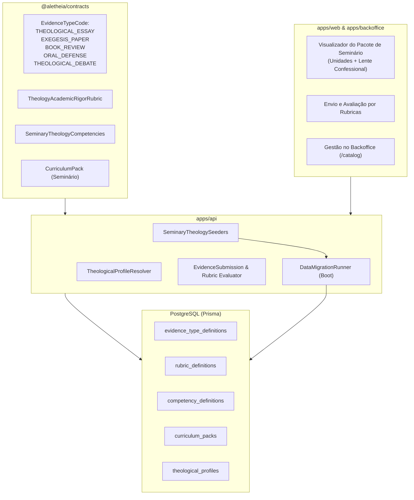

# Design Doc: Módulo Teológico Avançado (Nível Seminário)

## Metadados
- **Status:** Aprovado em Brainstorming
- **Data:** 2026-09-27
- **Issue de Origem:** [#176](https://github.com/Trinity-Grove/Aletheia/issues/176) (residual do checklist pedagógico [#95](https://github.com/Trinity-Grove/Aletheia/issues/95) seções 6 e 8)
- **Autor:** Antigravity / Jackson Wendel Santos Sá

---

## 1. Visão Geral e Objetivos

O Aletheia já disponibiliza trilhas de formação bíblica introdutória e intermediária focadas na narrativa bíblica e hermenêutica fundamental para famílias. A [Issue #176](https://github.com/Trinity-Grove/Aletheia/issues/176) destina-se a instituir o **Módulo Teológico Avançado (nível introdutório de seminário)**, abrangendo teologia sistemática, exegese em línguas originais, história da igreja, patrística, concílios ecumênicos, apologética, ética cristã e produção acadêmica supervisionada.

### Diretrizes de Produto Deliberadas
1. **Abordagem Pedagógica Híbrida**: Núcleo acadêmico comparativo neutro (que expõe a história dos dogmas, controvérsias e dados exegéticos com rigor e caridade intelectual) combinado com **Lentes Confessionais Eletivas** alimentadas pelo `TheologicalProfile` da família (`preferredTraditionCode` e `topicOverrides`).
2. **Formato Arquitetural**: Pacote Curricular Modular Especializado (`CurriculumPack`) denominado `ADVANCED_SEMINARY_THEOLOGY`, dividido em **4 Ciclos de Concentração**, gerando dados versionados no catálogo carregados automaticamente via `DataMigrationRunner`.
3. **Produção Acadêmica Real**: Tipos dedicados de evidência (`EvidenceTypeDefinition`) e rubrica analítica de rigor teológico (`RubricDefinition`) avaliando ensaios, resenhas de obras clássicas, artigos exegéticos e defesas orais com preservação no **Portfólio Teológico** do estudante.

---

## 2. Arquitetura do Sistema e Modelo de Dados

A arquitetura respeita o isolamento de fronteiras (`check:boundaries`), TypeScript estrito e tipagem Zod em `@aletheia/contracts`.

---

## 3. Especificação das Entidades e Catálogo de Dados

### 3.1 Novos Tipos de Evidência (`EvidenceTypeDefinition`)

Registrados no catálogo de tipos de evidência (`evidence_type_definitions`) com status `PUBLISHED`:

| Código | Nome | Descrição | Formatos Aceitos |
| :--- | :--- | :--- | :--- |
| `THEOLOGICAL_ESSAY` | Ensaio Teológico Sistemático | Artigo discursivo fundamentado em doutrinas sistemáticas com citações de fontes primárias e secundárias. | PDF, Documento de Texto |
| `EXEGESIS_PAPER` | Artigo Exegético Estruturado | Análise textual de perícope bíblica considerando contexto histórico-cultural, sintático e vocábulos originais. | PDF, Documento de Texto |
| `BOOK_REVIEW` | Resenha Crítica de Fonte Primária | Síntese analítica e apreciação crítica de obras clássicas patrísticas, conciliares ou da Reforma. | PDF, Texto |
| `ORAL_DEFENSE` | Defesa Oral / Seminário | Apresentação expositiva ou defesa oral gravada de tema teológico complexo. | Áudio, Vídeo, Link |
| `THEOLOGICAL_DEBATE` | Registro de Debate Teológico | Roteiro ou síntese de debate estruturado comparando correntes confessionais divergentes. | PDF, Texto, Gravação |

### 3.2 Rubrica de Rigor Teológico (`RubricDefinition`)

Definição `THEOLOGY_ACADEMIC_RIGOR_RUBRIC` com 4 critérios ponderados e 4 níveis de domínio (1: Inicial, 2: Em Desenvolvimento, 3: Proficiente, 4: Avançado):

1. **Fidelidade e Profundidade Exegética (Peso 30%)**:
   - Análise do texto bíblico no contexto histórico-gramatical e canônico.
   - Uso cuidadoso dos termos léxicos originais (Hebraico, Aramaico, Grego Koiné) sem falácias exegéticas.
2. **Coerência Sistemática (Peso 25%)**:
   - Articulação lógica das doutrinas sem contradições internas ou fragmentação conceitual.
   - Demonstração de relações orgânicas entre Teologia Própria, Cristologia, Soteriologia e Escatologia.
3. **Consciência Histórica e Documental (Peso 25%)**:
   - Conhecimento e citação direta dos credos universais, concílios ecumênicos e fontes patrísticas/reformadas.
   - Contextualização histórica das controvérsias teológicas sem anacronismos.
4. **Rigor Argumentativo e Caridade Intelectual (Peso 20%)**:
   - Estrutura acadêmica formal, bibliografia consistente e clareza de teses.
   - Caridade e representação justa de visões e correntes teológicas divergentes (*princípio da caridade hermenêutica*).

### 3.3 Matriz Curricular dos 4 Ciclos (24 Disciplinas da #95/#176)

O pacote curricular `ADVANCED_SEMINARY_THEOLOGY` organiza o estudo nas seguintes disciplinas detalhadas:

#### Ciclo I: Fundamentos & Método (Bíblia, Hermenêutica & Exegese)
1. **Bibliologia & Cânon**: Revelação geral e especial, inspiração verbal e plenária, inerrância, autoridade, formação do cânon do AT e NT e história da transmissão textual (crítica textual bíblica).
2. **Hermenêutica Bíblica**: Princípios de interpretação gramático-histórica, sensus literalis, analogia da fé, tipologia bíblica e identificação de gêneros literários (narrativa, profecia, sabedoria, epístola, apocalíptico).
3. **Exegese Bíblica Estruturada**: Método exegético em 7 passos (delimitação textual, contextualização, análise sintática/morfológica, análise léxica em línguas originais, teologia bíblica da passagem e aplicação expositiva).
4. **Teologia Bíblica da Redenção**: História progressiva da revelação e continuidade/descontinuidade das alianças (Adâmica, Noética, Abraâmica, Mosaica, Davídica e Nova Aliança em Cristo).

#### Ciclo II: Teologia Sistemática I (Deus, Criação, Queda e Salvação)
5. **Teologia Própria (Deus & Trindade)**: A essência de Deus, atributos incomunicáveis e comunicáveis, teologia trinitária clássica (Relações de Origem, Paternidade, Filiação, Processão) e decretos divinos.
6. **Antropologia Teológica**: A criação do ser humano à imagem e semelhança de Deus (*imago Dei*), constituição humana (dicotomia/tricotomia, monismo holístico), aliança de obras e dignidade humana.
7. **Hamartiologia**: A origem e essência do pecado, queda histórica, pecado original (culpa imputada vs corrupção herdada), transgressão e seus efeitos no cosmos e na sociedade.
8. **Cristologia & União Hipostática**: A divindade e humanidade plenas de Jesus Cristo, as decisões de Calcedônia, a comunicação de propriedades (*communicatio idiomatum*), estados de humilhação e exaltação, e as teorias históricas da expiação (*Christus Victor*, Satisfação Penal, Governamental, Moral).
9. **Pneumatologia**: A pessoa, divindade e eternidade do Espírito Santo, sua ação na criação, na iluminação bíblica, na ordem da salvação (*ordo salutis*) e na concessão de dons e frutos.
10. **Angelologia & Demonologia**: Criação, ordem e ministério dos anjos; queda angélica, natureza dos poderes caídos, discernimento espiritual bíblico e soberania de Deus sobre o mundo espiritual invisível.

#### Ciclo III: Teologia Sistemática II (Igreja & Escatologia Completa)
11. **Soteriologia (Graça, Eleição e Aliança)**: A aplicação da redenção na *ordo salutis* (eleição, chamado eficaz, regeneração, conversão, justificação pela fé, adoção, santificação progressiva, perseverança e glorificação).
12. **Eclesiologia**: A natureza e marcas da Igreja de Cristo (*Una, Sancta, Catholica, Apostolica*), formas de governo eclesiástico (Episcopal, Presbiteriano, Congregacional), sacramentos/ordenanças (Batismo infantil vs credobatismo, Ceia do Senhor: Transubstanciação, Consubstanciação, Presença Real Espiritual, Memorial).
13. **Escatologia Comparada (As 4 Escolas Milenistas - Seção 8 da #95)**:
    - *Pré-Milenismo Histórico*: Retorno visível de Cristo antes do milênio físico, unindo judeus e gentios, sem arrebatamento pré-tribulacional secreto.
    - *Pré-Milenismo Dispensacionalista*: Distinção entre Israel e Igreja, arrebatamento pré-tribulacional, 7 anos de Grande Tribulação e milênio literal terreno.
    - *Amilenismo*: O milênio compreendido como o reinado espiritual presente de Cristo entronizado no céu desde sua ascensão até a parusia.
    - *Pós-Milenismo*: O triunfo progressivo do Evangelho no mundo pelo poder do Espírito Santo precedendo a volta visível e gloriosa de Cristo.
14. **Modelos Interpretativos do Apocalipse (Seção 8 da #95)**:
    - *Preterista*: Cumprimento histórico central dos juízos no século I d.C. (queda de Jerusalém e Império Romano).
    - *Historicista*: Panorama profético contínuo da história da Igreja ocidental desde a era apostólica até o fim dos tempos.
    - *Idealista*: Dramatização simbólica permanente da luta cósmica entre o Reino de Deus e o dragão ao longo de toda a história humana.
    - *Futurista*: Cumprimento escatológico imediato concentrado no período anterior à segunda vinda de Cristo.
15. **Escatologia Individual & Geral**: Morte, imortalidade da alma, estado intermediário, ressurreição universal do corpo, juízo final, inferno/danação e Novos Céus e Nova Terra.

#### Ciclo IV: Teologia Histórica, Pensamento & Prática
16. **Patrística**: Os Pais Apostólicos (Clemente de Roma, Inácio de Antioquia, Policarpo de Esmirna), Apologistas primitivos (Justino Mártir, Atenágoras, Tertuliano) e Doutores Antigos (Orígenes, Atanásio, Agostinho de Hipona).
17. **Concílios Ecumênicos Históricos**: As controvérsias arianas, apolinaristas, nestorianas e monofisitas; Credo dos Apóstolos, Niceno-Constantinopolitano (381), Éfeso (431) e Definição de Calcedônia (451).
18. **Reforma Protestante**: Antecedentes medievais (Wycliffe, Hus), as *Cinco Solas* (*Sola Scriptura, Sola Gratia, Sola Fide, Solus Christus, Soli Deo Gloria*), e as quatro grandes vertentes (Luterana, Reformada/Calvinista, Anabatista e Anglicana).
19. **História Denominacional**: Formação histórica das tradições Batistas, Metodistas/Wesleyanas, Presbiterianas, Congregacionais e Pentecostais/Carismáticas no mundo e na América Latina.
20. **Teologia Histórica**: Evolução e refinamento do dogma cristão desde a era patrística, escolástica medieval, escolástica reformada/protestante e debates modernos.
21. **Apologética Cristã**: Metodologias apologéticas clássica (Tomás de Aquino, C.S. Lewis, William Lane Craig), evidencialista (Gary Habermas) e pressuposicionalista (Cornelius Van Til, Francis Schaeffer).
22. **Filosofia da Religião**: Argumentos clássicos da existência de Deus (cosmológico, teleológico, ontológico, moral), o problema do mal e do sofrimento (*teodiceia*), fé e razão, e epistemologia reformada (Alvin Plantinga).
23. **Ética Cristã**: Fundamentos da lei moral divina (Decálogo, Sermão do Monte), ética das virtudes cristãs, bioética (início e fim da vida), vocação, trabalho e ordem social.
24. **Missiologia**: O mandamento missionário (*Missio Dei*), fundamentos bíblicos do Antigo e Novo Testamento, teologia da contextualização sem sincretismo e história dos grandes movimentos missionários.

---

## 4. Integração Dinâmica com o `TheologicalProfile`

Nas disciplinas com divergências históricas consagradas (Ciclos II e III), o módulo divide cada aula em duas camadas:

1. **Camada Comum (Núcleo Descritivo e Exegético)**:
   - Apresenta as passagens bíblicas centrais, termos gregos/hebraicos, argumentos históricos de cada posição e contra-argumentos sem preconceito denominacional.
2. **Camada de Lente Confessional (Contextualizada pela Família)**:
   - Consulta o `TheologicalProfile` da família (`preferredTraditionCode`):
     - **`REFORMED` / `PRESBYTERIAN`**: Destaque e links para a *Confissão de Fé de Westminster*, *Catecismo Maior/Breve*, *Cânones de Dort* e *Catecismo de Heidelberg*.
     - **`WESLEYAN_ARMINIAN` / `METHODIST`**: Destaque para os *25 Artigos de Religião*, sermões padrões de John Wesley e tratados teológicos arminianos.
     - **`BAPTIST`**: Destaque para a *Confissão de Fé Batista de 1689* e *Declaração de Mensagem e Fé Batista*.
     - **`LUTHERAN`**: Destaque para a *Confissão de Augsburgo* e o *Livro de Concórdia*.
     - **`PENTECOSTAL_CHARISMATIC`**: Destaque para as declarações fundamentais sobre batismo no Espírito Santo e continuidade dos dons carismáticos.
     - **Genérico / Não configurado**: Exibe tabela comparativa ecumênica estruturada.

---

## 5. Estratégia de Implementação e Verificação

### 5.1 Fatiamento das Tarefas
- **Task 1: Contratos Zod & DTOs (`@aletheia/contracts`)**:
  - Exportação de novos enums e DTOs de evidências (`THEOLOGICAL_ESSAY`, `EXEGESIS_PAPER`, etc.), constantes de tópicos e rubrica teológica.
- **Task 2: Seeders no Backend (`apps/api`) & DataMigrationRunner**:
  - Criar `seminary-evidence-types.seeder.ts`, `seminary-rubrics.seeder.ts`, `seminary-competencies.seeder.ts` e `advanced-seminary-theology-pack.seeder.ts`.
  - Integrar com `DataMigrationRunner` no boot da API (`main.ts`).
- **Task 3: Visualizador do Módulo de Seminário no Frontend (`apps/web`)**:
  - Componente de visualização das 4 áreas de concentração, ementas, leituras primárias e chaveamento dinâmico da Lente Confessional baseada no `useTheologicalProfile`.
- **Task 4: Envio e Avaliação de Trabalhos Acadêmicos (`apps/web`)**:
  - Formulário especializado de envio de evidência com seleção de rubrica teológica e integração com o portfólio do aluno.
- **Task 5: Visualização e Gestão no Backoffice (`apps/backoffice`)**:
  - Exibição do pacote de seminário nas definições de catálogo (`/catalog`) e moderação de trabalhos acadêmicos se aplicável.
- **Task 6: Testes Automatizados, Boundaries e Qualidade Global**:
  - Verificação de cobertura de testes, compilação de rotas Next.js, `pnpm check:boundaries` (14/14) e ausência de trailers de IA.

---

## 6. Critérios de Aceite e Verificação

- [x] Todas as 24 disciplinas da Issue #95/#176 mapeadas com ementas, objetivos e bibliografias clássicas no pacote `ADVANCED_SEMINARY_THEOLOGY`.
- [x] 5 novos tipos de evidência e rubrica analítica de rigor teológico publicados no catálogo via `DataMigrationRunner`.
- [x] Renderização condicional e não destrutiva da lente confessional baseada no `TheologicalProfile` da família.
- [x] Interface de envio de trabalhos de seminário com critérios de avaliação por rubrica.
- [x] Zero violações de fronteira de módulos (`pnpm check:boundaries`).
- [x] Zero trailers de IA (`Co-Authored-By`, `Generated-By`) em todos os commits e documentos.
