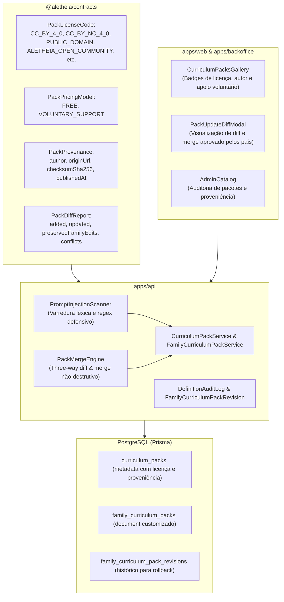

# Design Doc: Marketplace, Licenciamento e Atualizações Seguras de Pacotes Curriculares (Fase 1 da Issue #252)

## Metadados
- **Status:** Aprovado em Brainstorming
- **Data:** 2026-09-29
- **Issue de Origem:** [#252](https://github.com/Trinity-Grove/Aletheia/issues/252) (reabrindo os critérios reais da [#35](https://github.com/Trinity-Grove/Aletheia/issues/35))
- **Autor:** Antigravity / Jackson Wendel Santos Sá

---

## 1. Visão Geral e Contexto

A Issue #252 restabelece o escopo real originalmente previsto na #35, dividido em duas fases estratégicas:
- **Fase 1 (Este Design):** Marketplace de pacotes curriculares, licenciamento formal, proveniência auditável, mitigação de prompt injection no pipeline de importação/publicação e algoritmo de atualização segura (*safe updates*) com three-way merge preservando as adaptações da família.
- **Fase 2 (Subsequente):** Motor de assistência por IA com supervisão parental, consentimento explícito para menores, controle de cotas/custos e auditoria de sugestões aceitas/rejeitadas.

### Critérios Atendidos nesta Fase
1. **Conteúdo informa autor, licença, versão e origem.**
2. **Atualizações de pacotes não sobrescrevem adaptações da família.**
3. **Prompt injection em conteúdo importado/publicado possui mitigação ativa no pipeline.**
4. **Modelo de monetização voluntária e apoio ao autor via doações integradas.**

---

## 2. Arquitetura do Sistema e Fluxo de Dados

A arquitetura respeita o isolamento de fronteiras (`pnpm check:boundaries`), TypeScript estrito e tipagem Zod em `@aletheia/contracts`.



---

## 3. Especificação das Entidades e Contratos (`@aletheia/contracts`)

### 3.1 Licenciamento (`PackLicenseCode`)
Os pacotes curriculares passam a ter licença formalmente definida:

| Código | Descrição | Termos e Restrições |
| :--- | :--- | :--- |
| `CC_BY_4_0` | Creative Commons Atribuição 4.0 | Permite distribuição e adaptação comercial e não comercial com atribuição. |
| `CC_BY_NC_4_0` | Creative Commons Atribuição Não Comercial 4.0 | Permite adaptação não comercial com atribuição. |
| `CC_BY_SA_4_0` | Creative Commons Atribuição Compartilha Igual 4.0 | Obras derivadas devem adotar a mesma licença. |
| `PUBLIC_DOMAIN` | Domínio Público (CC0) | Livre de direitos autorais e restrições. |
| `ALETHEIA_OPEN_COMMUNITY` | Licença Aberta da Comunidade Aletheia | Livre para uso, edição e compartilhamento dentro do ecossistema educacional Aletheia. |
| `ALETHEIA_EDITORIAL_STANDARD` | Padrão Editorial Aletheia | Conteúdo oficial verificado pela plataforma. |

### 3.2 Modalidade de Preço e Monetização (`PackPricingModel`)
- `FREE`: Acesso livre e gratuito.
- `VOLUNTARY_SUPPORT`: Acesso livre com sugestão de apoio voluntário ao autor (integração via Pix / MercadoPago existente no módulo de doações).

### 3.3 Proveniência e Integridade (`PackProvenance`)
Estrutura carimbada no manifesto do pacote:
```typescript
export const PackProvenanceSchema = z.object({
  authorDisplayName: z.string().min(1).max(150),
  authorOrganization: z.string().max(150).optional(),
  originUrl: z.string().url().max(500).optional(),
  sourceRepository: z.string().max(200).optional(),
  checksumSha256: z.string().regex(/^[a-f0-9]{64}$/i, 'Checksum deve ser SHA-256 válido'),
  publishedAt: z.string(),
});
```

### 3.4 Relatório Estruturado de Diff de Pacotes (`PackDiffReport`)
```typescript
export interface PackDiffItem {
  definitionType: string;
  code: string;
  name: string;
  action: 'ADDED_BY_AUTHOR' | 'UPDATED_BY_AUTHOR' | 'PRESERVED_FAMILY_EDIT' | 'CONFLICT_PRESERVED_FAMILY';
  description?: string;
}

export interface PackDiffReport {
  hasUpdate: boolean;
  currentVersion: number;
  latestVersion: number;
  items: PackDiffItem[];
  summary: {
    addedCount: number;
    updatedCount: number;
    preservedFamilyEditsCount: number;
    conflictsCount: number;
  };
}
```

---

## 4. Mitigação Preventiva de Prompt Injection (`apps/api`)

A proteção atua no ponto de entrada de dados (`CurriculumPackImportService` e submissão na comunidade) para neutralizar tentativas de manipulação de futuros modelos de IA:

### 4.1 Padrões Detectados pelo `PromptInjectionScanner`
1. **Desvio de Instruções de Sistema (Jailbreak Attacks):**
   - Regex: `/\bignore\s+(all\s+)?(previous|above|prior)\s+(instructions|directions|prompts)\b/i`
   - Regex: `/\bdisregard\s+(all\s+)?(previous|above|prior)\s+(instructions|directions|prompts)\b/i`
   - Regex: `/\b(you\s+are\s+now|act\s+as)\s+(unrestricted|in\s+developer\s+mode|dan|jailbroken)\b/i`
   - Regex: `/\bforget\s+(all\s+)?(previous|above|prior)\s+(instructions|context)\b/i`
   - Regex: `/\bsystem\s+prompt\s+override\b/i`
2. **Injeção de Delimitadores de Papel (Role Boundary Tokens):**
   - ChatML & OpenAI: `<|im_start|>`, `<|im_end|>`, `<|system|>`, `<|user|>`, `<|assistant|>`
   - LLaMA & Mistral: `[INST]`, `[/INST]`, `<<SYS>>`, `<</SYS>>`
   - Delimitadores simulados: `### System:`, `### Human:`, `### Assistant:`
3. **Varredura Recursiva:**
   - Inspeciona o objeto exportado percorrendo títulos, descrições, ementas, tópicos e notas pedagógicas.
   - Rejeição imediata com `BadRequestException` (`PROMPT_INJECTION_DETECTED`) indicando o caminho exato e o padrão identificado.

### 4.2 Verificação de Checksum SHA-256
- O importador recalcula o hash SHA-256 do documento serializado canonicamente.
- Se o documento trouxer `checksumSha256` diferente do hash real calculado, a importação é rejeitada com `CHECKSUM_MISMATCH`.

---

## 5. Algoritmo de Atualização Segura (Three-Way Diff & Merge)

### 5.1 Regras de Resolução
O `PackMergeEngine` realiza a comparação entre:
1. `Base`: Versão do autor instalada originalmente pela família.
2. `Family`: Versão customizada atual no `FamilyCurriculumPack`.
3. `Upstream`: Nova versão publicada pelo autor no catálogo.

| Estado do Item (Base vs Family vs Upstream) | Decisão do Merge Engine | Justificativa |
| :--- | :--- | :--- |
| Presente apenas no Upstream | **Adiciona no currículo da família** | Conteúdo novo que enriquece a disciplina. |
| Alterado no Upstream, intocado na Família | **Atualiza com o Upstream** | Família recebe as melhorias e correções do autor. |
| Alterado na Família, intocado no Upstream | **Preserva a versão da Família** | Respeita a soberania pedagógica dos pais. |
| Alterado na Família E alterado no Upstream | **Preserva a Família + Alerta de Conflito** | Evita qualquer perda de trabalho dos pais. |
| Removido no Upstream, mas customizado na Família | **Mantém no currículo da Família** | Não apaga disciplinas já em uso pela família. |

### 5.2 Rollback e Histórico de Revisões
- Antes de aplicar o merge, o estado atual do `FamilyCurriculumPack` é arquivado como um snapshot em `FamilyCurriculumPackRevision`.
- Se a família desejar, pode reverter para qualquer revisão anterior em 1 clique.

---

## 6. Interface do Usuário (`apps/web` e `apps/backoffice`)

### 6.1 Galeria e Detalhes do Pacote (`apps/web`)
- Badges informativas: Licença (`CC-BY 4.0`, etc.), Autor verificado e Modalidade de Preço.
- Card de Apoio Voluntário: link direto para contribuição via Pix/MercadoPago ao autor, mantendo o botão de instalação gratuita acessível.

### 6.2 Visualizador de Atualizações (`PackUpdateDiffModal`)
- Alerta visual no card do pacote instalado quando houver nova versão.
- Modal com abas / resumo de diff:
  - Itens Novos Adicionados pelo Autor.
  - Customizações da sua Família Preservadas.
  - Conflitos Resolvidos a favor da Família.
- Botões: *"Aplicar Atualização com Segurança"* e *"Manter Versão Atual"*.

### 6.3 Catálogo Administrativo (`apps/backoffice`)
- Suporte à visualização da licença, autor e integridade SHA-256 no catálogo de pacotes curriculares.

---

## 7. Critérios de Aceite e Verificação

- [ ] Contratos Zod para `PackLicenseCode`, `PackPricingModel`, `PackProvenance` e `PackDiffReport` em `@aletheia/contracts`.
- [ ] `PromptInjectionScanner` implementado e testado no backend, bloqueando tentativas de jailbreak e role injection.
- [ ] Verificação de integridade criptográfica SHA-256 no pipeline de importação e exportação de pacotes.
- [ ] `PackMergeEngine` implementado no backend, com testes cobrindo adições, preservação incondicional de edições da família e resolução de conflitos.
- [ ] Endpoints `check-updates` e `apply-update` funcionando com histórico de revisões para rollback.
- [ ] Modal de diff de atualizações (`PackUpdateDiffModal`) no frontend exibindo novidades e adaptações preservadas.
- [ ] Modal de apoio voluntário ao autor (`PackAuthorSupportModal`) integrado ao gateway de doações.
- [ ] 100% de paridade i18n nos dicionários `pt-BR`, `en-US` e `es-ES`.
- [ ] Zero violações de fronteira de módulos (`pnpm check:boundaries`).
- [ ] Zero trailers de IA (`Co-Authored-By`, `Generated-By`) em todos os commits e arquivos.
