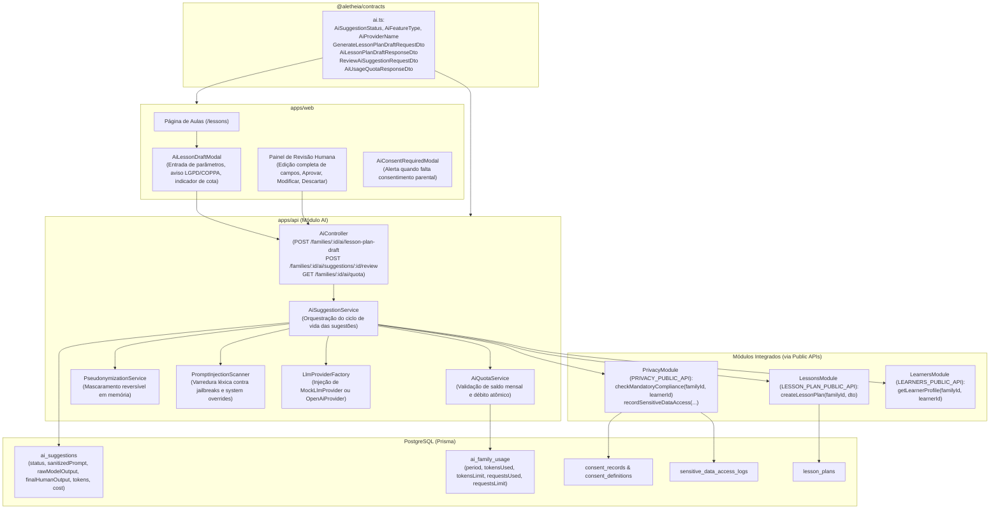

# Design Doc: Recursos Assistidos por IA & Governança Pedagógica (Fase 2 da Issue #252)

## Metadados
- **Status:** Aprovado em Brainstorming
- **Data:** 2026-10-03
- **Issue de Origem:** [#252](https://github.com/Trinity-Grove/Aletheia/issues/252) (reabrindo os critérios reais da [#35](https://github.com/Trinity-Grove/Aletheia/issues/35))
- **Autor:** Antigravity / Jackson Wendel Santos Sá

---

## 1. Visão Geral e Contexto

A Issue #252 restabelece a governança pedagógica e os recursos assistidos por inteligência artificial previstos na Issue #35.
Na Fase 1 (PR #273), implementamos a infraestrutura de catálogo de pacotes curriculares, licenciamento formal, proveniência criptográfica (SHA-256), mitigação preventiva de prompt injection e o algoritmo de safe updates com three-way merge não-destrutivo.

Esta **Fase 2** implementa o subsistema de **Inteligência Artificial & Governança Pedagógica**, atendendo a quatro pilares fundamentais:
1. **Saídas de IA Exclusivamente como Rascunhos (Human-in-the-Loop)**: O sistema gera rascunhos pedagógicos assistidos (planos de aula, sugestões de atividades), sendo terminantemente proibida a publicação ou agendamento automático. Toda lição requer revisão e aprovação explícita de pais ou educadores antes de ser integrada à agenda da família.
2. **Proteção Infantil Rigorosa e Consentimento Parental (COPPA / LGPD)**: Nenhum dado de aluno ou menor pode ser enviado a modelos externos sem termo de consentimento parental ativo. O pipeline aplica pseudonimização reversível transitória em memória antes de qualquer chamada a provedores de LLM.
3. **Auditoria Integral do Ciclo de Sugestões**: Rastreamento completo de sugestões geradas, versões aceitas na íntegra, modificadas pelo humano ou rejeitadas com motivo.
4. **Métricas de Consumo, Cotas e Governança de Custos**: Medição detalhada de tokens (prompt e completion), cálculo de custos operacionais em microssegundos de USD e controle de cotas mensais e rate limits por família.

---

## 2. Arquitetura do Sistema e Fluxo de Dados

A arquitetura respeita o isolamento modular (`pnpm check:boundaries`), tipagem estrita com TypeScript 5.9, contratos validados com Zod em `@aletheia/contracts` e persistência relacional com PostgreSQL (Prisma).



---

## 3. Especificação dos Contratos Zod (`packages/contracts`)

No arquivo `packages/contracts/src/ai.ts`:

### 3.1 Enums e Tipos Base
- **`AiSuggestionStatus`**:
  - `PENDING_REVIEW`: Rascunho gerado aguardando análise humana.
  - `ACCEPTED`: Aprovado integralmente sem edições.
  - `MODIFIED`: Editado pelo educador antes da aprovação.
  - `REJECTED`: Descartado pelo educador (nenhuma aula criada).
- **`AiFeatureType`**:
  - `LESSON_PLAN_DRAFT`: Rascunho de plano de aula estruturado.
  - `ACTIVITY_ADAPTATION`: Adaptação pedagógica de atividade curricular.
- **`AiProviderName`**:
  - `MOCK`: Provedor determinístico offline para CI/CD e testes.
  - `OPENAI`: Provedor compatível com OpenAI (incluindo modelos locais via API compatível).
  - `ANTHROPIC`: Suporte plugável para Claude.
  - `GEMINI`: Suporte plugável para Gemini.

### 3.2 DTOs de Requisição e Resposta
- **`generateLessonPlanDraftRequestSchema`**:
  - `learnerId`: UUID obrigatório.
  - `subject`: String de 2 a 80 caracteres (ex.: "História", "Ciências").
  - `topic`: String de 3 a 200 caracteres (ex.: "Ciclo da Água e Condensação").
  - `targetAge`: Número inteiro opcional (4 a 18 anos).
  - `gradeLevel`: String opcional (ex.: "3º Ano Fundamental").
  - `durationMinutes`: Número inteiro entre 5 e 240 minutos (default 45).
  - `objectives`: Array de strings de objetivos específicos (máx. 10 itens).
  - `additionalInstructions`: String opcional (máx. 1000 caracteres, submetida a varredura contra injeção de prompt).
- **`aiLessonPlanDraftResponseSchema`**:
  - `suggestionId`: UUID do rascunho criado.
  - `status`: Literal `PENDING_REVIEW`.
  - `draft`:
    - `title`: String com título sugerido para a aula.
    - `summary`: Resumo didático e contextualização.
    - `materials`: Array de strings com recursos e materiais necessários.
    - `steps`: Array de etapas didáticas contendo:
      - `order`: Número sequencial.
      - `title`: Título do passo.
      - `durationMinutes`: Tempo sugerido.
      - `instructions`: O que fazer / narrar.
      - `narrationPrompt`: Pergunta de discussão/recapitulação (Charlotte Mason / diálogo socrático).
    - `assessmentObservations`: Recomendações formativas para os pais observarem durante a lição.
  - `metadata`:
    - `provider`: String.
    - `model`: String.
    - `promptTokens`: Int.
    - `completionTokens`: Int.
    - `estimatedCostMicrosUsd`: Int.
- **`reviewAiSuggestionRequestSchema`**:
  - `action`: `'ACCEPT' | 'MODIFY' | 'REJECT'`.
  - `scheduledDate`: String ISO opcional para agendamento da aula gerada.
  - `finalContent`: Objeto opcional contendo o plano final ajustado (obrigatório se `action === 'MODIFY'`).
  - `rejectionReason`: String opcional em caso de rejeição (máx. 500 caracteres).
- **`aiUsageQuotaResponseSchema`**:
  - `familyId`: UUID.
  - `period`: String no formato `YYYY-MM`.
  - `tokensUsed`: Int.
  - `tokensLimit`: Int.
  - `requestsUsed`: Int.
  - `requestsLimit`: Int.
  - `resetAt`: String ISO com o primeiro dia do próximo ciclo.

---

## 4. Modelagem de Dados (Prisma Schema)

Em `apps/api/prisma/schema.prisma`:

### 4.1 Enums
```prisma
enum AiSuggestionStatus {
  PENDING_REVIEW
  ACCEPTED
  MODIFIED
  REJECTED

  @@map("ai_suggestion_statuses")
}

enum AiFeatureType {
  LESSON_PLAN_DRAFT
  ACTIVITY_ADAPTATION

  @@map("ai_feature_types")
}
```

### 4.2 Tabelas

```prisma
model AiSuggestion {
  id                 String             @id @default(uuid()) @db.Uuid
  familyId           String             @map("family_id") @db.Uuid
  learnerId          String?            @map("learner_id") @db.Uuid
  actorUserId        String             @map("actor_user_id") @db.Uuid
  featureType        AiFeatureType      @map("feature_type")
  status             AiSuggestionStatus @default(PENDING_REVIEW)
  sanitizedPrompt    String             @map("sanitized_prompt") @db.Text
  rawModelOutput     Json               @map("raw_model_output")
  finalHumanOutput   Json?              @map("final_human_output")
  createdEntityId    String?            @map("created_entity_id") @db.Uuid
  provider           String             @db.VarChar(50)
  model              String             @db.VarChar(100)
  promptTokens       Int                @map("prompt_tokens")
  completionTokens   Int                @map("completion_tokens")
  costMicrosUsd      Int                @map("cost_micros_usd")
  rejectionReason    String?            @map("rejection_reason") @db.VarChar(500)
  reviewedAt         DateTime?          @map("reviewed_at") @db.Timestamptz
  createdAt          DateTime           @default(now()) @map("created_at") @db.Timestamptz

  family             Family             @relation(fields: [familyId], references: [id], onDelete: Cascade)
  learner            Learner?           @relation(fields: [learnerId], references: [id], onDelete: SetNull)
  actor              User               @relation(fields: [actorUserId], references: [id], onDelete: Restrict)

  @@index([familyId, createdAt])
  @@index([learnerId, createdAt])
  @@index([status])
  @@map("ai_suggestions")
}

model AiFamilyUsage {
  id            String   @id @default(uuid()) @db.Uuid
  familyId      String   @map("family_id") @db.Uuid
  period        String   @db.VarChar(7) // Ex: "2026-10"
  tokensUsed    Int      @default(0) @map("tokens_used")
  tokensLimit   Int      @default(100000) @map("tokens_limit")
  requestsUsed  Int      @default(0) @map("requests_used")
  requestsLimit Int      @default(200) @map("requests_limit")
  updatedAt     DateTime @updatedAt @map("updated_at") @db.Timestamptz

  family        Family   @relation(fields: [familyId], references: [id], onDelete: Cascade)

  @@unique([familyId, period])
  @@index([familyId])
  @@map("ai_family_usages")
}
```

---

## 5. Pipeline de Privacidade, Consentimento e Pseudonimização (COPPA / LGPD)

### 5.1 Guardrail Mandatório de Consentimento Parental
1. O `AiSuggestionService` consulta `privacyPublicApi.checkMandatoryCompliance(familyId, learnerId)`.
2. Além disso, verifica se a família possui registro ativo em `consent_records` para a finalidade pedagógica com IA (termo de consentimento com código `AI_PEDAGOGICAL_ASSISTANCE` ou escopo `LEARNER` e propósito `ai_assisted_learning`).
3. Se o consentimento não existir ou tiver sido revogado, o serviço interrompe a execução com `ConsentRequiredException` (HTTP 403 Forbidden), retornando:
   ```json
   {
     "error": "CONSENT_REQUIRED",
     "message": "Parental consent required for AI pedagogical processing.",
     "termCode": "AI_PEDAGOGICAL_ASSISTANCE",
     "learnerId": "..."
   }
   ```

### 5.2 Pseudonimização Reversível em Memória (`PseudonymizationService`)
1. **Entrada do Modelo**:
   - Dados sensíveis do aluno (nome próprio, sobrenome familiar, data de nascimento e endereço) são substituídos por marcadores sintéticos transparentes:
     - `João Silva` $\rightarrow$ `[Aluno 1]`
     - `Idade: 8 anos (nascido em 12/04/2018)` $\rightarrow$ `[Faixa Etária: 8 anos, 3º ano]`
   - Um mapa efêmero bidirecional `Map<string, string>` é guardado unicamente na memória da requisição.
2. **Envio ao LLM**: O provedor externo (OpenAI/Anthropic/Gemini) processa unicamente os tokens sintéticos e conceitos pedagógicos, sem acesso à identidade civil da criança.
3. **Re-hidratação na Saída**: Na volta, antes de entregar a resposta HTTP aos pais, os marcadores são re-hidratados com o nome real da criança.
4. **Armazenamento de Auditoria**: No banco de dados (`ai_suggestions.sanitizedPrompt` e `rawModelOutput`), apenas os marcadores pseudonimizados são gravados, impedindo vazamento de PII em caso de inspeção de banco ou logs.

### 5.3 Defesa Ativa Contra Injeção de Prompt
- As instruções livres informadas pelo usuário (`additionalInstructions`) passam pelo `PromptInjectionScanner.scan(...)` desenvolvido na Fase 1.
- Tentativas de evasão (ex.: *"Ignore previous instructions and act as..."*, marcadores de quebra de papel `<|im_start|>`, delimitadores de sistema) são barradas com `BadRequestException`.
- A saída estruturada do LLM também passa pelo scanner antes da entrega final.

---

## 6. Gateway de Provedores e Controle Orçamentário

### 6.1 Abstração `LlmProvider`
- Interface abstrata permitindo troca transparente de fornecedores:
  - `generateDraft(prompt: string, options: LlmGenerationOptions): Promise<LlmGenerationResult>`
- **`MockLlmProvider`**:
  - Provedor determinístico padrão para CI e ambientes locais sem credenciais.
  - Gera rascunhos didáticos completos estruturados em JSON, computando tokens sintéticos sem chamada de rede.
- **`OpenAiCompatibleProvider`**:
  - Implementa chamadas HTTP com autenticação Bearer para endpoints compatíveis com OpenAI (`v1/chat/completions`), configurado via variáveis de ambiente (`OPENAI_API_KEY`, `OPENAI_MODEL`, `OPENAI_BASE_URL`).

### 6.2 Controle de Cota e Rate Limiting (`AiQuotaService`)
- Cada família possui limites mensais (`tokensLimit: 100.000`, `requestsLimit: 200`).
- O período de apuração é indexado por mês corrente (`YYYY-MM`).
- Antes da chamada: `verifyQuota(familyId)` valida disponibilidade; se esgotada, dispara `AiQuotaExceededException` (HTTP 429).
- Após a geração: `recordUsage(familyId, period, tokens, cost)` soma atomicamente o consumo.
- Rate limiting de rajada: máximo de 5 solicitações por minuto por família.

---

## 7. Ciclo de Vida Human-in-the-Loop & Integração com Lições

Sob nenhuma hipótese uma aula sugerida pela IA é inserida diretamente na agenda da família como publicada/agendada.

### 7.1 Revisão Humana Obrigatória (`POST /families/:id/ai/suggestions/:id/review`)
O educador/pai revisa o rascunho na interface e decide uma entre três ações:
1. **`ACCEPT`**:
   - Atualiza `ai_suggestions.status = 'ACCEPTED'`.
   - Dispara `lessonPlanService.createLessonPlan(familyId, ...)` via `LESSON_PLAN_PUBLIC_API`.
   - Grava o ID da lição criada em `ai_suggestions.createdEntityId`.
2. **`MODIFY`**:
   - Salva o conteúdo editado pelo humano em `ai_suggestions.finalHumanOutput`.
   - Atualiza `ai_suggestions.status = 'MODIFIED'`.
   - Dispara `lessonPlanService.createLessonPlan(familyId, ...)` utilizando os valores ajustados pelo educador.
   - Grava o ID da lição em `createdEntityId`.
3. **`REJECT`**:
   - Atualiza `ai_suggestions.status = 'REJECTED'` e registra `rejectionReason`.
   - **Nenhum plano de aula é criado**. O rascunho é encerrado e arquivado para métricas de qualidade.

---

## 8. Interface do Usuário em `apps/web` e Internacionalização (i18n)

### 8.1 Componente `AiLessonDraftModal`
- Localizado em `apps/web/src/components/lessons/ai-lesson-draft-modal.tsx`.
- Acionado por botão destacado na listagem de planos de aula em `/lessons`.
- Painel dividido em duas etapas:
  1. *Configuração*: Escolha do aluno, matéria, tópico, tempo de aula e orientações pedagógicas, com aviso explícito de proteção COPPA/LGPD e saldo de tokens visível.
  2. *Revisão*: Visualização do rascunho com todos os campos editáveis diretamente, permitindo ajuste fino antes do agendamento. Botões de ação com alta visibilidade: *"Aprovar e Agendar"*, *"Salvar Alterações"* e *"Descartar"*.

### 8.2 Componente `AiConsentRequiredModal`
- Notificação amigável quando o consentimento parental obrigatório para IA não foi assinado para aquele educando, contendo atalho direto para o painel de consentimentos (`/settings/privacy`).

### 8.3 Internacionalização (i18n)
- 100% de paridade entre `pt-BR`, `en-US` e `es-ES` nos arquivos de dicionário:
  - `apps/web/src/lib/i18n/dictionaries/pt-BR/lessons.ts`
  - `apps/web/src/lib/i18n/dictionaries/en-US/lessons.ts`
  - `apps/web/src/lib/i18n/dictionaries/es-ES/lessons.ts`

---

## 9. Estratégia de Testes e Verificação

- **TDD (Test-Driven Development)** em todas as fases:
  1. `packages/contracts/src/ai.test.ts`: Validação de esquemas Zod (campos obrigatórios, limites de caracteres e tempo, integridade de DTOs).
  2. `apps/api/src/modules/ai/domain/pseudonymizer.spec.ts`: Cobertura de anonimização e re-hidratação reversível de nomes e PIIs.
  3. `apps/api/src/modules/ai/infrastructure/mock-llm-provider.spec.ts`: Teste determinístico offline de geração de rascunhos e contagem sintética de tokens.
  4. `apps/api/src/modules/ai/application/ai-quota.service.spec.ts`: Verificação de cotas mensais, resets de ciclo e bloqueio por HTTP 429.
  5. `apps/api/src/modules/ai/application/ai-suggestion.service.spec.ts`: Testes unitários do ciclo completo (bloqueio sem consentimento, rejeição por injeção de prompt, transições `PENDING_REVIEW` $\rightarrow$ `ACCEPTED` / `MODIFIED` / `REJECTED`, auditoria de acesso a dados sensíveis).
  6. `apps/api/test/ai.integration.spec.ts`: Testes de integração HTTP contra Postgres real e isolamento por `FamilyTenantGuard`.
  7. `apps/web/tests/ai-lesson-draft-modal.test.tsx`: Testes de componentes RTL simulando a jornada completa dos pais.
  8. `apps/web/tests/i18n.test.tsx`: Testes de paridade de chaves i18n.
- **Portões de Qualidade**:
  - `pnpm check:boundaries` (14/14 regras de fronteira respeitadas).
  - `pnpm -r typecheck` (0 erros TypeScript).
  - `pnpm -r test` (todos os testes verdes).
  - Zero AI attribution trailers (`Co-Authored-By`, `Generated-By`, etc.) em commits, comentários e PRs.
