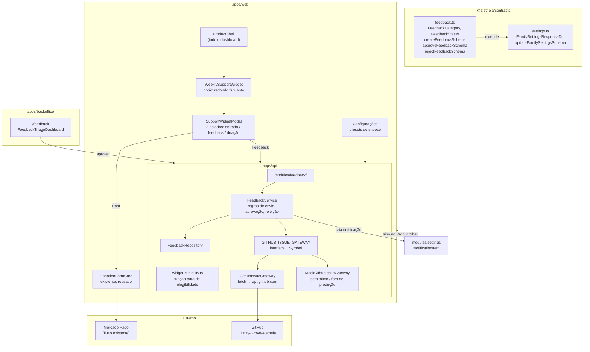

# Design Doc: Widget Semanal de Apoio Voluntário e Feedback da Comunidade

## Metadados
- **Status:** Aprovado em Brainstorming
- **Data:** 2026-10-04
- **Escopo:** `@aletheia/contracts`, `apps/api`, `apps/web`, `apps/backoffice`
- **Issue de Origem:** a criar — widget semanal de feedback/doação, triagem no backoffice e abertura automática de issue no GitHub

---

## 1. Visão Geral e Contexto

O Aletheia já possui o fluxo de apoio voluntário (módulo `donations`, gateway do Mercado Pago, tela `/support` com `DonationFormCard` e histórico de recibos), construído sob o princípio de **zero paywalls**: o produto é e será gratuito e irrestrito, e quem querjez nível-lo é a这个人, não o produto.

O que **não** existe hoje é o caminho de volta: nenhumafamília tem como *dizer algo* sobre o produto. Não há canal de feedback, não há triagem, e não existe integração alguma com o GitHub no repositório — o único lugar onde o roadmap é público.

Este documento define um **widget flutuante de apoio e feedback** que:

1. Aparece **uma vez por semana** por família, como um marcador de livro flutuante que não atrapalha nenhuma visualização.
2. Abre um **modal com duas opções**: doar ou mandar feedback.
3. Encaminha o relato para o **admin no backoffice**.
4. Ao ser **aprovado**, transforma o relato em **issue no GitHub** do repositório `Trinity-Grove/Aletheia`.
5. **Some sozinho** por auto-dismiss, ou quando o usuário pede para não aparecer por um prazo definido — ajustável também nas Configurações.

A Petsc é nacional: **anonimato por padrão, com opt-in explícito do usuário para se identificar.** Como o GitHub é público e o Aletheia lida com dados de menores, essa é a decisão de segurança central deste design.

---

## 2. Decisões de Produto

Todas as decisões abaixo foram tomadas em conjunto durante o brainstorming e são **contratos de escopo** para o plano de implementação.

| # | Tema | Decisão |
|---|---|---|
| D1 | Conteúdo do modal | **Escolha dentro do modal.** Abre com dois atalhos: "Quero apoiar" e "Quero dar feedback". Ninguém recebe um pedido de doação quando queria apenas comentar. |
| D2 | Identidade no GitHub | **Anônimo por padrão, com opt-in explícito.** O usuário pode deliberadamente se identificar marcando uma caixa no envio. O consentimento é congelado no momento do envio. |
| D3 | Ciclo semanal | **7 dias desde a última aparição; interação reinicia o relógio.** |
| D4 | Dispensar | **Presets de 1 semana / 1 mês / sempre**, disponíveis tanto no widget quanto na tela de Configurações, com o mesmo vocabulário nos dois lugares. |
| D5 | Audiência | **Somente papéis de responsável:** `OWNER_GUARDIAN`, `GUARDIAN`, `CO_GUARDIAN`. Não aparece para `EDUCATOR`, nem no portal do aluno, nem para mentores. |
| D6 | Retorno ao usuário | **Notificação em ambos os desfechos:** aprovada (com link da issue) e rejeitada (com o motivo). |
| D7 | Persistência da cadência | **No servidor**, em `FamilySettings`. Sobrevive à troca de dispositivo; um opt-out "sempre" é respeitado de verdade. |
| D8 | Integração GitHub | **Gateway abstraído**, espelhando o padrão de `DONATION_GATEWAY`. Chamada síncrona dentro do pedido de aprovação, com marcador idempotente. |
| D9 | Falha do GitHub | **O relato não muda de status.** Permanece `PENDING` com `lastIssueError` preenchido, e o admin pode tentar de novo. |

---

## 3. Arquitetura do Sistema e Fluxo de Dados

Quatro unidades novas, cada uma com uma responsabilidade única e testável isoladamente.



### 3.1 Fronteiras de módulo

| Unidade | Local | Responsabilidade |
|---|---|---|
| Widget + modal | `apps/web/src/components/support/weekly-support-widget.tsx` | Quando aparecer, auto-dismiss, os três estados do modal |
| Preferência de cadência | `FamilySettings` (tabela existente) + 2 colunas | O relógio de 7 dias e o snooze |
| `feedback` (API) | `apps/api/src/modules/feedback/` | Receber o relato, guardá-lo, decidir aprovação/rejeição |
| `GITHUB_ISSUE_GATEWAY` | `apps/api/src/modules/feedback/infrastructure/` | Criar e localizar a issue, isolado atrás de interface |

O widget **não decide elegibilidade sozinho**: quem calcula é a API, porque a verdade é por família e precisa sobreviver à troca de dispositivo. A função de elegibilidade é uma função pura, sem React e sem banco.

---

## 4. Modelo de Dados

### 4.1 `FamilySettings` — duas colunas novas

```prisma
model FamilySettings {
  // ... campos existentes ...
  supportWidgetLastSeenAt   DateTime? @map("support_widget_last_seen_at") @db.Timestamptz
  supportWidgetSnoozedUntil DateTime? @map("support_widget_snoozed_until") @db.Timestamptz
}
```

Ambas `DateTime?`. Nenhum outro campo desta tabela muda.

**Semântica importante:** `"sempre"` grava `9999-12-31` em `supportWidgetSnoozedUntil`, **não `null`**, porque `null` significa "sem snooze, mostrar agora". Isso faz o botão "Reativar agora" ser um único `PATCH` com `null`, sem caso especial no meio.

### 4.2 `FeedbackSubmission` — tabela nova

```prisma
enum FeedbackCategory { BUG  IDEA  QUESTION  PRAISE  @@map("feedback_categories") }
enum FeedbackStatus   { PENDING  APPROVED  REJECTED  @@map("feedback_statuses") }

model FeedbackSubmission {
  id                String            @id @default(uuid()) @db.Uuid
  familyId          String            @map("family_id") @db.Uuid
  submittedByUserId String            @map("submitted_by_user_id") @db.Uuid
  category          FeedbackCategory
  message           String            @db.Text

  // Contexto técnico anexado pelo cliente no momento do envio
  pagePath   String? @map("page_path")
  locale     String?
  appVersion String? @map("app_version")
  userAgent  String? @map("user_agent")

  // ---- Identidade: SNAPSHOT IMUTÁVEL, congelado no envio ----
  identifySelf    Boolean @default(false) @map("identify_self")
  submitterName   String? @map("submitter_name")
  submitterEmail  String? @map("submitter_email")

  // ---- Triagem ----
  status             FeedbackStatus @default(PENDING)
  adminNote          String?        @map("admin_note") @db.Text
  lastIssueError     String?        @map("last_issue_error")
  reviewedByUserId   String?        @map("reviewed_by_user_id") @db.Uuid
  reviewedAt         DateTime?      @map("reviewed_at") @db.Timestamptz
  githubIssueNumber  Int?           @map("github_issue_number")
  githubIssueUrl     String?        @map("github_issue_url")

  createdAt DateTime @default(now()) @db.Timestamptz
  updatedAt DateTime @updatedAt @db.Timestamptz

  family        Family @relation(fields: [familyId], references: [id], onDelete: Cascade)
  submittedBy   User   @relation("FeedbackSubmitter", fields: [submittedByUserId], references: [id], onDelete: Restrict)
  reviewedBy    User?  @relation("FeedbackReviewer", fields: [reviewedByUserId], references: [id], onDelete: SetNull)

  @@index([status, createdAt])
  @@index([familyId, createdAt])
  @@map("feedback_submissions")
}
```

### 4.3 A regra de privacidade: `identifySelf`

O consentimento é capturado **no envio** e nunca é editável depois.

- **`identifySelf: false`** (padrão) → gravamos apenas o `submittedByUserId`, necessário para auditoria e para conseguir notificar a família. **Não duplicamos nome nem e-mail** em colunas próprias.
- **`identifySelf: true`** → gravamos `submitterName` e `submitterEmail` **congelados**, para que a issue seja reproduzível mesmo se a pessoa mudar o nome depois.

Consequência: aprovar um relato **não pode** ser transformado em vazamento de PII por engano. Ou o consentimento foi dado no envio, ou o campo nem existe no registro.

### 4.4 Enums que ganham valores novos

```prisma
enum NotificationType {
  // ... existentes ...
  FEEDBACK_APPROVED
  FEEDBACK_REJECTED
}

enum SensitiveDataResourceType {
  // ... existentes ...
  FEEDBACK_SUBMISSION   // texto livre do usuário, tied a userId
}
```

Registrar `FEEDBACK_SUBMISSION` no enum de dados sensíveis faz o acesso do admin ao texto do usuário entrar na trilha `SensitiveDataAccessLog` que o módulo de privacidade já mantém. Custa uma linha de migration e mantém o texto do usuário no mesmo regime de proteção dos outros dados de família.

---

## 5. Contratos (`@aletheia/contracts`)

Novo arquivo `packages/contracts/src/feedback.ts`:

```ts
export const feedbackCategorySchema = z.enum(['BUG', 'IDEA', 'QUESTION', 'PRAISE']);
export type FeedbackCategory = z.infer<typeof feedbackCategorySchema>;

export const feedbackStatusSchema = z.enum(['PENDING', 'APPROVED', 'REJECTED']);
export type FeedbackStatus = z.infer<typeof feedbackStatusSchema>;

export const createFeedbackSchema = z.object({
  category: feedbackCategorySchema,
  message: z.string().trim().min(10).max(4000),
  identifySelf: z.boolean().default(false),
  pagePath: z.string().max(200).optional(),
  locale: z.string().max(10).optional(),
  appVersion: z.string().max(40).optional(),
  userAgent: z.string().max(400).optional(),
});

export const approveFeedbackSchema = z.object({
  title: z.string().trim().min(5).max(180),
  labels: z.array(z.string().trim().min(1).max(50)).max(8).default([]),
  adminNote: z.string().trim().max(2000).optional(),
});

export const rejectFeedbackSchema = z.object({
  reason: z.string().trim().min(5).max(1000),   // motivo é obrigatório
});

export const adminFeedbackResponseSchema = z.object({
  id: z.string().uuid(),
  familyId: z.string().uuid(),
  submitterName: z.string().nullable(),     // null quando identifySelf = false
  category: feedbackCategorySchema,
  message: z.string(),
  status: feedbackStatusSchema,
  identifySelf: z.boolean(),
  pagePath: z.string().nullable(),
  locale: z.string().nullable(),
  appVersion: z.string().nullable(),
  adminNote: z.string().nullable(),
  lastIssueError: z.string().nullable(),
  githubIssueNumber: z.number().int().nullable(),
  githubIssueUrl: z.string().nullable(),
  createdAt: z.string(),
  reviewedAt: z.string().nullable(),
});
```

O DTO de **autoatribuição** (`SubmitterFeedbackResponseDto`) é deliberadamente mais estreito que o admin: devolve apenas `id`, `status`, `category`, `identifySelf` e `createdAt`. A família nunca recebe de volta `submitterEmail` nem nada que vaze PII para o outro lado.

Estensões em `packages/contracts/src/settings.ts`:

```ts
// FamilySettingsResponseDto
supportWidgetLastSeenAt: z.string().nullable(),
supportWidgetSnoozedUntil: z.string().nullable(),

// updateFamilySettingsSchema
supportWidgetLastSeenAt: z.string().datetime().nullable().optional(),
supportWidgetSnoozedUntil: z.string().datetime().nullable().optional(),
```

`FamilySettingsResponseDto` **não** expõe `supportWidgetLastSeenAt`/`supportWidgetSnoozedUntil` a papéis não responsáveis: o controller já filtra por permissão no service.

---

## 6. API

### 6.1 Endpoints de família

Guardados por `JwtAuthGuard` + `FamilyTenantGuard`, exatamente como `DonationsController`.

| Método | Rota | Função |
|---|---|---|
| `POST` | `/api/v1/families/:familyId/feedback` | Cria a submissão. Restrito a papéis de responsável. |

**Não há endpoint novo para o widget.** O `PATCH /api/v1/families/:familyId/settings` e o `GET` correspondente **já existem** em `FamilySettingsController` e passam a carregar os dois campos novos.

### 6.2 Endpoints de admin

Guardados por `PlatformAdminGuard`, seguindo `admin-users.controller.ts`.

| Método | Rota | Função |
|---|---|---|
| `GET` | `/api/v1/admin/feedback` | Lista com filtros `status`, `category`, paginação `take`/`skip` |
| `GET` | `/api/v1/admin/feedback/:id` | Detalhe para o painel |
| `POST` | `/api/v1/admin/feedback/:id/approve` | Abre a issue no GitHub e marca `APPROVED` |
| `POST` | `/api/v1/admin/feedback/:id/reject` | Marca `REJECTED` com motivo obrigatório |

O acesso de leitura do admin a `message`, `submitterName` e `submitterEmail` é registrado em `SensitiveDataAccessLog` com `resourceType: FEEDBACK_SUBMISSION`.

---

## 7. Gateway do GitHub

### 7.1 Interface

Espelha `DonationGateway` — interface, `Symbol` de injeção e factory:

```ts
export interface GithubIssueGateway {
  createIssue(params: {
    title: string;
    body: string;
    labels: string[];
  }): Promise<{ number: number; url: string }>;

  findIssueByMarker(marker: string): Promise<{ number: number; url: string } | null>;
}

export const GITHUB_ISSUE_GATEWAY = Symbol('GITHUB_ISSUE_GATEWAY');
```

### 7.2 Factory e variáveis de ambiente

| Variável | Padrão | Papel |
|---|---|---|
| `GITHUB_ISSUE_PROVIDER` | derivado | `github` usa a implementação real; qualquer outro valor usa o mock |
| `GITHUB_TOKEN` | — | PAT com escopo `repo`. **Ausente em produção = erro alto**, não mock |
| `GITHUB_REPO_OWNER` | `Trinity-Grove` | Dono do repositório |
| `GITHUB_REPO_NAME` | `Aletheia` | Nome do repositório |

Implementação real com `fetch` global contra `https://api.github.com/repos/{owner}/{repo}/issues`, que já é o padrão do `MercadoPagoDonationGateway`. Sem dependência nova no `package.json`.

### 7.3 O marcador idempotente

O corpo de toda issue criada por este fluxo começa com:

```html
<!-- aletheia-feedback-id: 9f3c1b2e-....-.... -->
```

**Por que existe.** A ordem correta é GitHub **antes** do banco: não dá para segurar uma transação do Prisma aberta durante uma chamada de rede. Mas isso abre uma janela — o GitHub cria a issue, e a gravação no banco falha logo depois. Na retentativa, sem proteção, abriríamos uma **issue duplicada**.

**Como funciona.** Antes de criar, `findIssueByMarker` procura uma issue aberta que já contenha o UUID. Achou, reaproveita o número e a URL. Custo: uma busca a mais por aprovação. Benefício: nunca duplica.

**Escapamento obrigatório.** O texto do usuário é escapado antes de virar Markdown. Sem isso, um relato contendo `<!-- aletheia-feedback-id:` conseguiria forjar o marcador de outro relato e sequestrar a aprovação dele.

### 7.4 Corpo da issue

```markdown
<!-- aletheia-feedback-id: <uuid> -->
**Categoria:** Bug
**Relatado em:** 04/10/2026 · pt-BR
**Página:** /curriculum/packs
**Versão:** 1.4.0

<texto do usuário, palavra por palavra>

---
### Contexto do time (administração)
<nota do admin, opcional>
```

O texto do usuário vai **literal**, sem edição. O admin edita o **título** e acrescenta a própria nota, mas não reescreve a fala de quemelsonareportou.

O bloco de identificação é acrescentado **apenas** quando `identifySelf === true`:

```markdown
---
**Reportado por:** Nome da Pessoa (email@example.com)
```

Labels automáticas: `feedback` sempre, mais uma por categoria — `BUG` → `bug`, `IDEA` → `enhancement`, `QUESTION` → `question`, `PRAISE` → `praise`. O admin pode editar a lista antes de aprovar.

### 7.5 Sequência da aprovação

1. Admin clica em **Aprovar e abrir issue**, informando título, labels e nota opcional.
2. `findIssueByMarker(uuid)` — se achar, reaproveita; senão, `createIssue`.
3. **Só então** grava `APPROVED` + número + URL, e cria a `NotificationItem`.
4. Se o passo 2 falhar: grava `lastIssueError`, **o status continua `PENDING`**, e a resposta é `502`. Nenhuma notificação é enviada.

O status nunca mente: `APPROVED` significa que a issue existe de fato.

---

## 8. Frontend — o Widget

### 8.1 Montagem

Um único ponto de montagem: **dentro do `ProductShell`**. Uma linha e o widget existe em todas as telas do dashboard, sem ninguém precisar lembrar de incluí-lo.

### 8.2 Elegibilidade

Função pura, em módulo próprio, sem React e sem banco:

```ts
export function isWidgetEligible(
  now: Date,
  lastSeenAt: Date | null,
  snoozedUntil: Date | null,
): boolean {
  if (snoozedUntil !== null && snoozedUntil > now) return false;
  if (lastSeenAt !== null && addDays(lastSeenAt, 7) > now) return false;
  return true;
}
```

Mais dois filtros que não são de dados:

- Papel em {`OWNER_GUARDIAN`, `GUARDIAN`, `CO_GUARDIAN`}.
- **Nunca em `/support`** — quem abriu a página de apoio completa já viu tudo que o widget oferece.

### 8.3 Quando o relógio grava

`supportWidgetLastSeenAt` é gravado **no momento em que o widget é elegível e renderiza**, não depois do auto-dismiss. Isso faz "7 dias desde a última aparição" funcionar com um único `PATCH` e sem segunda escrita.

Se o usuário interagir (clicou, enviou, dispensou), gravamos de novo — é aí que entra o "interação reinicia" da decisão D3.

O `PATCH` vai sem espera: a UI não bloqueia renderização por causa disso, e se falhar o pior caso é o widget reaparecer antes da hora.

### 8.4 Auto-dismiss

**20 segundos** sem interação → o botão some e não volta naquela sessão. Nenhum estado é gravado, porque `lastSeenAt` já foi escrito na montagem.

Consequência prática: quem ignora vê o botão uma vez e só volta a vê-lo em 7 dias.

Não é necessário `IntersectionObserver`: o botão é `position: fixed` e não sai da tela.

### 8.5 Posicionamento

Valores tirados do design system (`packages/ui/src/styles/components.css`):

| Propriedade | Valor | Razão |
|---|---|---|
| `z-index` | `200` | Acima da tab bar (40), abaixo do modal (999). Nunca encoberto pela tab bar, nunca cobre um diálogo aberto. |
| `bottom` (desktop) | `1.5rem` | Canto inferior direito, longe da sidebar. |
| `bottom` (mobile) | `calc(var(--ui-tab-bar-height) + env(safe-area-inset-bottom, 0px) + 0.75rem)` | Senta logo acima da tab bar, usando a mesma variável que o design system já usa. |
| `right` | `1.5rem` desktop / `0.75rem` mobile | — |
| diâmetro | `44px` | Mínimo de alvo de toque. |

Formato: **botão redondo discreto**, com um toque suave de cor. Escolhido no brainstorming sobre as alternativas de fita ancorada na borda — a fita de livro página horizontal disputava espaço com a sidebar no desktop e com a tab bar no mobile.

### 8.6 Os três estados do modal

1. **Entrada** — título, subtítulo, e dois atalhos em **linhas empilhadas** com ícone, título e descrição: "Quero apoiar" / "Quero dar feedback". Rodapé com "Agora não" e o atalho de snooze.
2. **Feedback** — seletor de categoria (4 opções), textarea, **caixa desmarcada** "Quero que meu nome e e-mail apareçam quando alguém responder", aviso de que o texto pode ficar público, e o botão "Enviar".
3. **Doação** — **`DonationFormCard` reusado dentro do modal**, mais um link "Ver a página completa de apoio" que leva para `/support`, que já tem o histórico de recibos. Nenhum código de pagamento novo.

### 8.7 Configurações

Seção nova em `apps/web/app/(dashboard)/settings/page.tsx`: **"Widget de apoio e feedback"** com os mesmos presets do widget — 1 semana / 1 mês / sempre — mais "Reativar agora". Um único vocabulário de prazos nos dois lugares: nada de o usuário ver "7 dias" no botão e "1 semana" nas configurações.

---

## 9. Backoffice — Triagem

Página `/feedback`, quinto item da nav do `AdminShell` ("Feedback da Comunidade"), seguindo a convenção de `pack-moderation-dashboard.tsx`.

- Lista os relatos `PENDING`, com categoria, data e um selo claro de **"Relato anônimo"** ou **"Autor identificado"** — para o admin ver, sem abrir o banco, se a issue vai sair com nome ou sem.
- Ao abrir um relato, um painel mostra o texto completo, os metadados de contexto, campo de título, checkboxes de label e a nota da administração.
- Ações: **Aprovar e abrir issue** / **Rejeitar** (motivo obrigatório).
- Já aprovado: mostra o link da issue. Com `lastIssueError` preenchido: mostra o erro e o botão vira **Tentar de novo**.

---

## 10. Notificações

Dois valores novos em `NotificationType`, pelo módulo de notifications que já existe:

| Evento | Tipo | Conteúdo |
|---|---|---|
| Issue criada com sucesso | `FEEDBACK_APPROVED` | "Seu feedback virou a issue #321", com link. |
| Relato rejeitado | `FEEDBACK_REJECTED` | "Seu feedback não foi aceito", com o motivo que o admin escreveu. |

A notificação só é criada **depois** que a issue existe de fato — decisão D9. Família que espera no vácuo é pior do que família que recebe o aviso um pouco depois.

---

## 11. Internacionalização (i18n)

O `AGENTS.md` é explícito: **toda chave nova em `pt-BR` precisa de `en-US` e `es-ES` no mesmo commit**; o TypeScript (`Dictionary`) e os testes de paridade bloqueiam o build caso falte tradução ou variável `{var}`.

Novo domínio **`support-widget.ts`** nos três dicionários de `apps/web`:

- `apps/web/src/lib/i18n/dictionaries/pt-BR/support-widget.ts`
- `apps/web/src/lib/i18n/dictionaries/en-US/support-widget.ts`
- `apps/web/src/lib/i18n/dictionaries/es-ES/support-widget.ts`

Cobre: título e subtítulo do modal, os dois atalhos, os quatro labels de categoria, os três presets de snooze, o texto da caixa de identificação, o aviso de texto público e o estado vazio.

Registrado no `index.ts` de cada dicionário. Datas, números e valores deConfigs **sempre** pelos formatadores de `useLocale()`.

O backoffice ganha `feedback.ts` nos três dicionários dele também — é a primeira página de lá a passar por i18n (as outras, nav e usuários, estão com pt-BR fixo). Fazemos esta página no padrão da regra sem refatorar as vizinhas.

---

## 12. Estratégia de Testes

TDD em todas as camadas.

### 12.1 Contratos
`packages/contracts/src/feedback.test.ts` — schemas Zod de criação, aprovação e rejeição (limites de tamanho, motivo obrigatório, defaults), e as extensões de `updateFamilySettingsSchema` / `FamilySettingsResponseDto`.

### 12.2 API — unitários
- `apps/api/src/modules/feedback/application/feedback.service.spec.ts` — `identifySelf: false` não grava nome nem e-mail; `true` grava o snapshot imutável; falha do gateway mantém `PENDING` com `lastIssueError` e não notifica; rejeição exige motivo; `APPROVED` só é gravado depois da issue.
- `apps/api/src/modules/feedback/infrastructure/github-issue.gateway.spec.ts` — URL e headers corretos, `findIssueByMarker` acha e não acha, **escape do texto do usuário antes de virar Markdown**, marcador sempre presente.
- `apps/api/src/modules/feedback/domain/widget-eligibility.spec.ts` — 7 dias, `snoozedUntil` no passado, `snoozedUntil = 9999-12-31`, boundary exato de 7 dias.
- `apps/api/src/modules/feedback/infrastructure/mock-github-issue.gateway.spec.ts`.

### 12.3 API — integração
`apps/api/test/feedback-github.integration-spec.ts` — fluxo completo com o mock gateway, na convenção de `donations-mercadopago.integration-spec.ts`: criação, isolamento por `FamilyTenantGuard`, aprovação, caminho de falha, e retentativa que reaproveita a issue pelo marcador em vez de duplicar.

### 12.4 Frontend
`apps/web/tests/weekly-support-widget.test.tsx` — não renderiza quando inelegível; renderiza quando elegível; grava `lastSeenAt` na montagem; auto-dismiss aos 20s com fake timers; `PATCH` de snooze com o valor certo; os três estados do modal; caixa de identificação desmarcada por padrão; nunca renderiza em `/support` nem para `EDUCATOR`.

`apps/web/tests/i18n.test.tsx` — paridade das chaves novas nas três locales.

### 12.5 Backoffice
`apps/backoffice/tests/feedback-triage.test.tsx` — lista, abertura do painel, aprovação, exibição do erro com retentativa.

### 12.6 Portões de qualidade
- `pnpm check:boundaries` (todas as regras de fronteira respeitadas — o módulo `feedback` só importa de `platform` e de `@aletheia/contracts`).
- `pnpm -r typecheck` (0 erros).
- `pnpm -r test` (verde).
- Zero trailers de atribuição de IA (`Co-Authored-By`, `Generated-By`) em commits, comentários e PRs.

---

## 13. Riscos e Mitigações

| Risco | Mitigação |
|---|---|
| **Token do GitHub ausente em produção.** Sem `GITHUB_TOKEN`, o factory devolveria o mock e aprovações "funcionariam" criando issue fictícia — em silêncio. | O mock só é permitido fora de `NODE_ENV=production`. Em produção, token ausente faz a aprovação **falhar alto**. Desvio deliberado do padrão de `donations`: lá uma doação falsa é business, aqui uma aprovação falsa é trabalho perdido. |
| **PII em repositório público.** | Snapshot imutável no envio + escape de Markdown antes de montar o corpo. O que o sistema não pode impedir é o usuário digitar o próprio telefone no texto livre — por isso o formulário avisa explicitamente que o texto pode ficar público. A escolha é consciente, não um vazamento. |
| **Issue duplicada por falha parcial.** | Marcador HTML idempotente + `findIssueByMarker` antes de criar. |
| **Perda de relato por falha do GitHub.** | O relato nunca sai de `PENDING`; `lastIssueError` é exibido e a ação é repetível. Nenhuma notificação falsa é enviada. |
| **Rate limit do GitHub.** | 5000/hr autenticado contra alguns relatos por semana. Sem preocupação real. |

---

## 14. Fora de Escopo

Explícito, para não crescer durante a implementação:

- **Sem webhook do GitHub de volta para o app.** Não há sincronização de status "issue fechada".
- **Sem anexo ou imagem no feedback.**
- **Sem o admin reescrever o texto do usuário.** Ele edita o título e acrescenta nota própria.
- **Sem widget no portal do aluno** (`/aluno`) **nem para mentores.**
- **Sem A/B test de copy.**
- **Sem badge de "novo"** no botão.
- **Sem edição do texto do relato** pelo usuário após o envio.
- **Sem fila de jobs.** Aprovações são síncronas com retentativa manual.

---

## 15. Checklist de Arquivos Tocados

### Contratos
- `packages/contracts/src/feedback.ts` (novo)
- `packages/contracts/src/feedback.test.ts` (novo)
- `packages/contracts/src/index.ts` (export)
- `packages/contracts/src/settings.ts` (extensões)

### Prisma
- `apps/api/prisma/schema.prisma` — `FeedbackSubmission`, 2 enums novos, `FeedbackCategory`/`FeedbackStatus`, 2 valores em `NotificationType`, 1 valor em `SensitiveDataResourceType`, 2 colunas em `FamilySettings`
- `apps/api/prisma/migrations/<timestamp>_weekly_support_widget/` (nova)

### API
- `apps/api/src/modules/feedback/feedback.module.ts` (novo)
- `apps/api/src/modules/feedback/index.ts` (novo)
- `apps/api/src/modules/feedback/domain/widget-eligibility.ts` + `.spec.ts` (novos)
- `apps/api/src/modules/feedback/application/feedback.service.ts` + `.spec.ts` (novos)
- `apps/api/src/modules/feedback/infrastructure/feedback.repository.ts` (novo)
- `apps/api/src/modules/feedback/infrastructure/github-issue.gateway.interface.ts` (novo)
- `apps/api/src/modules/feedback/infrastructure/github-issue.gateway.ts` (novo)
- `apps/api/src/modules/feedback/infrastructure/github-issue.gateway.factory.ts` (novo)
- `apps/api/src/modules/feedback/infrastructure/mock-github-issue.gateway.ts` + `.spec.ts` (novos)
- `apps/api/src/modules/feedback/presentation/feedback.controller.ts` + `.spec.ts` (novos)
- `apps/api/src/modules/feedback/presentation/feedback-admin.controller.ts` + `.spec.ts` (novos)
- `apps/api/src/app.module.ts` (registro do módulo)
- `apps/api/src/modules/settings/domain/family-settings.entity.ts` (2 campos)
- `apps/api/src/modules/settings/application/family-settings.service.ts` (2 campos + filtro por permissão)
- `apps/api/src/modules/settings/infrastructure/family-settings.repository.ts` (2 colunas)
- `apps/api/src/modules/settings/application/notification.service.ts` (2 tipos)
- `apps/api/test/feedback-github.integration-spec.ts` (novo)

### Frontend
- `apps/web/src/components/support/weekly-support-widget.tsx` (novo)
- `apps/web/src/components/support/support-widget-modal.tsx` (novo)
- `apps/web/src/components/support/feedback-form.tsx` (novo)
- `apps/web/src/components/support/index.ts` (exports)
- `apps/web/src/components/layout/product-shell.tsx` (ponto de montagem)
- `apps/web/src/lib/api/feedback-client.ts` (novo)
- `apps/web/app/(dashboard)/settings/page.tsx` (seção de snooze)
- `apps/web/src/lib/i18n/dictionaries/{pt-BR,en-US,es-ES}/support-widget.ts` (novos)
- `apps/web/src/lib/i18n/dictionaries/{pt-BR,en-US,es-ES}/index.ts` (registro)
- `apps/web/tests/weekly-support-widget.test.tsx` (novo)

### Backoffice
- `apps/backoffice/app/feedback/page.tsx` (novo)
- `apps/backoffice/src/components/feedback/feedback-triage-dashboard.tsx` (novo)
- `apps/backoffice/src/components/layout/admin-shell.tsx` (item de nav)
- `apps/backoffice/src/lib/api/index.ts` (cliente)
- `apps/backoffice/src/lib/i18n/dictionaries/{pt-BR,en-US,es-ES}/feedback.ts` (novos)
- `apps/backoffice/tests/feedback-triage.test.tsx` (novo)

### Documentação
- `docs/operations/` — variáveis de ambiente `GITHUB_TOKEN`, `GITHUB_REPO_OWNER`, `GITHUB_REPO_NAME`, `GITHUB_ISSUE_PROVIDER`

---

## 16. Definição de Pronto

- [ ] Widget aparece 1x por semana para papéis de responsável, some sozinho em 20s e respeita snooze de 1 semana / 1 mês / sempre, no widget e nas Configurações.
- [ ] Modal com dois atalhos; doar reusa `DonationFormCard`; nenhum código de pagamento novo.
- [ ] Relato chega anônimo por padrão; marcar a caixa congela nome e e-mail no envio.
- [ ] Admin vê selo de "Relato anônimo" / "Autor identificado" e aprova ou rejeita com motivo.
- [ ] Aprovar cria a issue no GitHub com marcador idempotente; retentativa não duplica.
- [ ] Falha do GitHub mantém `PENDING`, exibe o erro e permite tentar de novo.
- [ ] Família notificada nos dois desfechos, com link da issue ou motivo da rejeição.
- [ ] `pt-BR`, `en-US` e `es-ES` em paridade; build bloqueia se faltar tradução.
- [ ] `pnpm check:boundaries`, `pnpm -r typecheck` e `pnpm -r test` verdes.